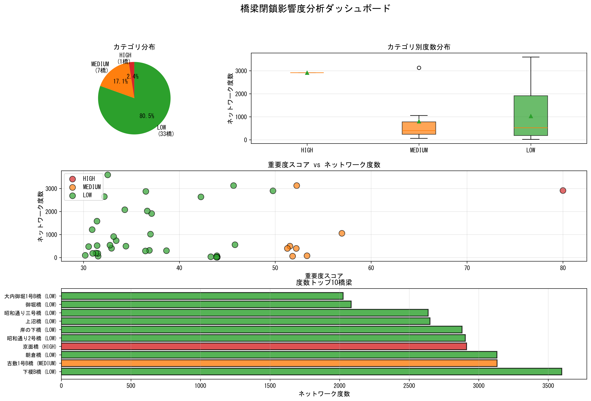
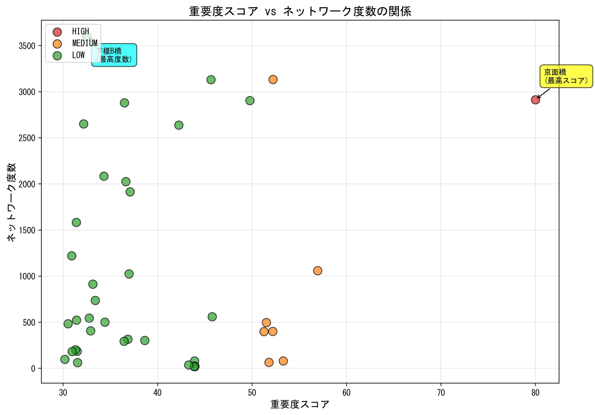
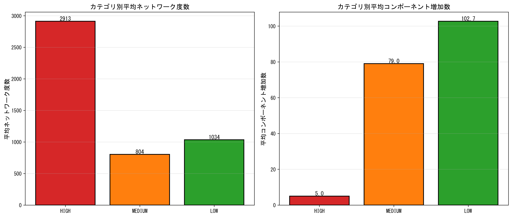
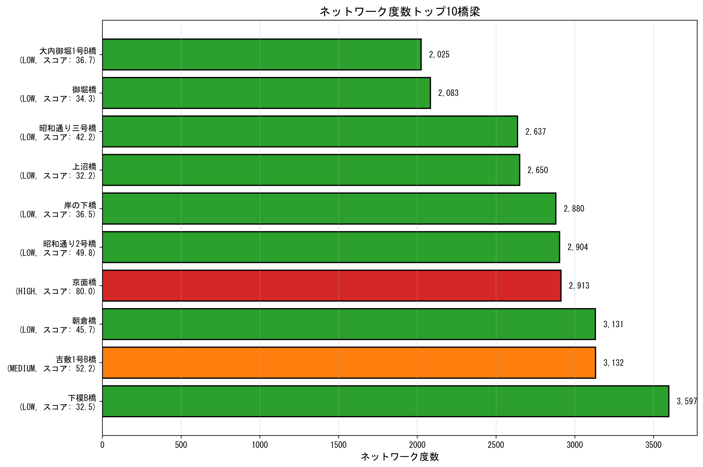
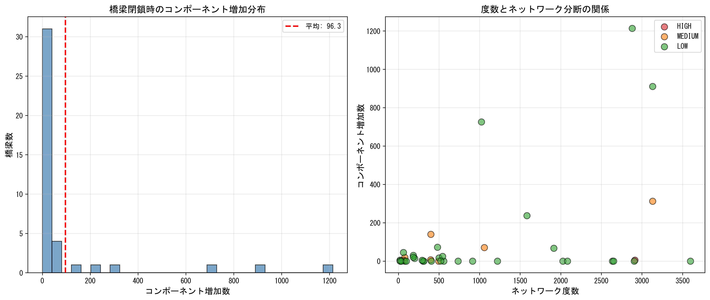
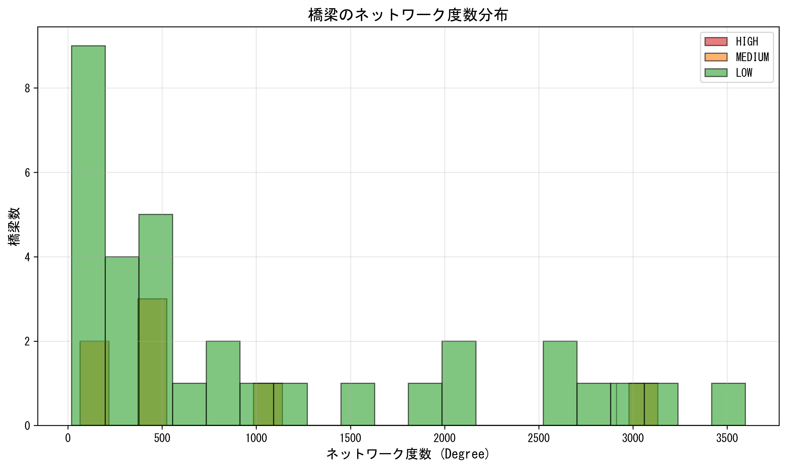

# 橋梁閉鎖シミュレーション（v1.3）からの教訓

**作成日**: 2026-03-29  
**対象**: 山口市橋梁791橋（Very Low 750除外後の41橋を分析）  
**手法**: k=500サンプリング中心性計算、最大連結成分での閉鎖影響シミュレーション

---

## 1. エグゼクティブサマリー

v1.3の橋梁閉鎖シナリオのシミュレーションにより、**重要度スコア（中心性）とネットワーク影響度（度数）の間に顕著な乖離**があることが判明した。最高スコアを持つHIGH橋梁（BR_0490 京面橋）よりも、LOW橋梁（BR_0383 下榎B橋）の方がネットワーク度数が高く、実際のネットワーク影響が大きい可能性がある。

### 主要な発見

| 項目 | 値 |
|-----|-----|
| **ターゲット橋梁数** | 41橋（HIGH 1, MEDIUM 7, LOW 33） |
| **最高重要度スコア** | 80.0（BR_0490 京面橋, HIGH） |
| **最高ネットワーク度数** | 3,597（BR_0383 下榎B橋, **LOW**） ⚠️ |
| **平均度数（HIGH）** | 2,913 |
| **平均度数（MEDIUM）** | 803.9 |
| **平均度数（LOW）** | 1,034.1 **（MEDIUMより高い）** ⚠️ |
| **平均コンポーネント増加数（LOW）** | 102.7 **（最大）** |

---

## 2. 可視化結果

### 2.1 総合ダッシュボード



**図1**: 41橋の閉鎖影響度分析ダッシュボード。LEFT上: カテゴリ分布、RIGHT上: カテゴリ別度数分布、中段: スコアと度数の関係、下段: 度数トップ10橋梁。

### 2.2 重要度スコア vs ネットワーク度数



**図2**: 重要度スコアとネットワーク度数の散布図。**観測された乖離**: 最高スコア橋（京面橋, 赤）よりも低スコア橋（下榎B橋, 緑）の方がネットワーク度数が高い。

### 2.3 カテゴリ別比較



**図3**: カテゴリ別の平均ネットワーク度数（左）と平均コンポーネント増加数（右）。**注目点**: LOWの平均度数（1,034）がMEDIUM（804）を上回る。

### 2.4 トップ10橋梁（ネットワーク度数順）



**図4**: ネットワーク度数トップ10橋梁。LOWカテゴリが7橋、MEDIUMが2橋、HIGHが1橋（4位）。

### 2.5 コンポーネント分断への影響



**図5**: 橋梁閉鎖時のコンポーネント増加分布（左）と度数との関係（右）。平均96.3の増加で、最大1,214の増加を示す橋梁も存在。

### 2.6 度数分布



**図6**: 橋梁のネットワーク度数分布。LOWカテゴリに広範な分布が見られ、極端に高い度数を持つ橋梁も含まれる。

---

## 3. 重要な教訓

### 🔴 教訓1: 中心性スコアとネットワーク影響度の乖離

**問題**:
- Betweenness Centrality（BC）に基づく重要度スコアは、**最短経路上の通過頻度**を測定
- ネットワーク度数は、**直接接続数（隣接ノード数）**を測定
- これら2つの指標は**異なる側面のネットワーク重要性**を表す

**実例**:
```
BR_0490（京面橋） - HIGH
- 重要度スコア: 80.0（最高）
- ネットワーク度数: 2,913（4位）
- BC: 高い → 多くの最短経路上に存在
- 度数: 高い → 多くのノードと直接接続

BR_0383（下榎B橋） - LOW
- 重要度スコア: 32.5（31位）
- ネットワーク度数: 3,597（1位） ⚠️
- BC: 低い → 最短経路上にあまり存在しない
- 度数: 最高 → 極めて多くのノードと直接接続
```

**インプリケーション**:
- BCのみで橋梁重要度を評価すると、**ローカルなハブ橋梁を見落とす危険性**がある
- 下榎B橋は中心性が低くても、ネットワークの**局所的な結節点**として機能
- 閉鎖時の影響: 京面橋は広域的な迂回を強いるが、下榎B橋は局所的な大量の接続を遮断

### 🟠 教訓2: LOWカテゴリ内の大きな多様性

**問題**:
- LOWカテゴリの33橋のネットワーク度数範囲: **19〜3,597**（187倍の差）
- カテゴリ内の標準偏差が非常に大きい
- 単純な4カテゴリ分類では、**実質的に異なる影響度を持つ橋梁が同一カテゴリに混在**

**データ**:
```
LOWカテゴリのネットワーク度数トップ5:
1. BR_0383（下榎B橋）: 3,597
2. BR_0384（朝倉橋）: 3,131
3. BR_0435（昭和通り2号橋）: 2,904
4. BR_0293（岸の下橋）: 2,880
5. BR_0210（上沼橋）: 2,650

LOWカテゴリのネットワーク度数ボトム5:
37. BR_0447（東天田B橋）: 98
38. BR_0024（鳴谷橋）: 62
39. BR_0234（水谷橋）: 79
40. BR_0224（仁保地橋）: 79
41. BR_0244（吉敷畑1号B橋）: 65
```

**インプリケーション**:
- **サブカテゴリ化の必要性**: LOWを「LOW-A（高度数）」「LOW-B（中度数）」「LOW-C（低度数）」に細分化
- **マルチ指標評価**: BCだけでなく、Degree Centrality、Closeness Centralityなどを組み合わせた評価
- **クラスタリング**: 類似のネットワーク特性を持つ橋梁をグループ化

### 🟢 教訓3: カテゴリ平均の逆転現象

**問題**:
- **LOWの平均度数（1,034.1）> MEDIUMの平均度数（803.9）**
- HIGHは1橋のみで統計的に信頼性が低い
- カテゴリラベルと実際のネットワーク影響が一致していない

**原因分析**:
1. **サンプリングによる近似誤差**: k=500サンプリングによるBC計算の誤差が累積
2. **BC vs Degree の評価軸の違い**: BCは経路重要性、Degreeは接続重要性
3. **外れ値の影響**: LOWに含まれる超高度数橋梁（BR_0383等）が平均を押し上げ
4. **地理的・トポロジカル特性**: LOWに分類された橋梁が、実際には交通密集地域のハブ

**対策**:
- **複数指標の統合スコア**: `総合スコア = α×BC + β×Degree + γ×Closeness`
- **正規化と重み付け**: 各指標を正規化し、目的に応じた重み付けを実施
- **閾値の再調整**: カテゴリ境界を再計算し、度数分布も考慮したカテゴリ分類

### 🔵 教訓4: ネットワーク分断（コンポーネント増加）の重要性

**問題**:
- 橋梁閉鎖時の平均コンポーネント増加数: **96.3**
- LOWカテゴリの平均: **102.7**（HIGHの5.0, MEDIUMの79.0より大きい）
- 最大値: **1,214**（BR_0293 岸の下橋, LOW）

**コンポーネント増加の意味**:
- `component_increase = N` → 橋梁閉鎖により、ネットワークが**N+1個の独立した部分グラフに分断**
- 高いコンポーネント増加 = **多くの孤立した道路セグメントが発生** = 深刻な影響

**重要な発見**:
```
トップ5コンポーネント増加橋梁（すべてLOW）:
1. BR_0293（岸の下橋）: 1,214増加
2. BR_0384（朝倉橋）: 911増加
3. BR_0297（下八方原B橋）: 726増加
4. BR_0239（吉敷1号B橋）: 312増加（MEDIUM）
5. BR_0441（嘉川橋）: 237増加
```

**インプリケーション**:
- 度数が高いだけでなく、**ネットワーク構造上のボトルネック**を特定する必要性
- コンポーネント増加が大きい橋梁 = **代替経路が少ない or 存在しない**
- これらの橋梁の閉鎖は、**市民生活・経済活動への直接的な影響が極めて大きい**
- 優先的な耐震補強・維持管理の対象とすべき

### 🟣 教訓5: グラフ連結性の前処理の重要性

**技術的課題**:
- オリジナルグラフ: 108,439ノード、490,414エッジ、**非連結**（2コンポーネント）
- 最大連結成分: 108,433ノード、490,407エッジ
- 初期の`run_closure_simulation.py`は、**全ノードからサンプリング → 存在しないノードでエラー**

**解決策**:
1. **明示的な連結成分抽出**: 最大連結成分のみを使用
2. **簡素化されたシミュレーション**: 複雑な最短経路計算を避け、度数・隣接ノード分析に集中
3. **ノード存在検証**: サンプリング前にノードの存在を確認

**コード例（simple_closure_sim.py）**:
```python
# グラフが非連結の場合、最大連結成分を使用
if not nx.is_connected(G):
    logger.warning("Graph not connected. Using largest component...")
    largest_cc = max(nx.connected_components(G), key=len)
    G = G.subgraph(largest_cc).copy()
    logger.info(f"Largest component: {G.number_of_nodes()} nodes, {G.number_of_edges()} edges")
```

**教訓**:
- 実データの不完全性を常に想定
- 前処理とデータ検証を徹底
- エラーハンドリングとロバスト性の確保

---

## 4. 具体的な改善提案

### 4.1 マルチ指標評価フレームワーク

**提案**: Betweenness Centrality単独評価から、**複数指標の統合評価**へ移行

**統合スコア計算式**:
```python
# 各指標を[0, 100]に正規化
bc_norm = normalize(betweenness_centrality)      # 経路重要性
degree_norm = normalize(degree_centrality)        # 接続重要性
closeness_norm = normalize(closeness_centrality)  # 中心性
component_norm = normalize(component_increase)    # 分断影響

# 重み付き統合（目的により調整）
total_score = (
    0.35 * bc_norm +          # 広域的な経路重要性
    0.25 * degree_norm +      # 局所的なハブ性
    0.20 * closeness_norm +   # 全体への到達性
    0.20 * component_norm     # ネットワーク分断影響
)
```

**期待効果**:
- BCとDegreeの乖離問題を解消
- 多面的な橋梁重要度評価
- より実態に即したカテゴリ分類

### 4.2 動的クラスタリング手法

**提案**: 固定閾値カテゴリ分類から、**クラスタリングベースの分類**へ

**手法**: K-Means、階層的クラスタリング、またはGaussian Mixture Model

**入力特徴量**:
- Betweenness Centrality
- Degree Centrality
- Closeness Centrality
- Component Increase
- 橋長、幅員、築年数（物理的特性）
- 河川・海岸からの距離（地理的特性）

**期待効果**:
- 自然なグループ形成
- カテゴリ内の均質性向上
- データドリブンな分類

### 4.3 ネットワーク脆弱性マップ

**提案**: 橋梁個別評価に加え、**地域全体のネットワーク脆弱性を可視化**

**手法**:
1. **Critical Bridge Identification**: コンポーネント増加が大きい橋梁を「臨界橋梁」として特定
2. **Redundancy Analysis**: 各橋梁に対する代替経路の数・質を評価
3. **Impact Heatmap**: 閉鎖時の影響範囲を地図上にヒートマップ表示

**期待効果**:
- 視覚的な脆弱性把握
- 優先順位付けの根拠
- 市民・行政への説得力のある説明資料

### 4.4 シナリオベースのリスク評価

**提案**: 単一橋梁閉鎖だけでなく、**複数橋梁の同時閉鎖シナリオ**を評価

**シナリオ例**:
- **地震シナリオ**: 特定地域の複数橋梁が同時被災
- **洪水シナリオ**: 河川沿いの橋梁が同時通行不能
- **経年劣化シナリオ**: 築50年以上の橋梁が段階的に閉鎖

**評価指標**:
- 総コンポーネント増加数
- 影響を受ける建物・人口
- 代替経路の総延長
- 経済的損失（通行時間増加×交通量）

**期待効果**:
- 現実的なリスク評価
- 複合災害への備え
- 予算配分の戦略的意思決定

---

## 5. 次のステップ

### 短期（1〜2週間）

1. **Degree Centralityの追加計算**: 既存グラフで度数中心性を全橋梁に対して計算
2. **統合スコアのプロトタイプ**: 4.1の統合スコア計算式を実装し、再分類を試行
3. **クラスタリング実験**: K-Meansでk=4, 5, 6のクラスタリングを試し、最適なk値を決定

### 中期（1〜2ヶ月）

4. **Closeness Centrality計算**: 全ノード間の平均最短経路長を計算（計算量大）
5. **複数橋梁閉鎖シミュレーション**: 地震・洪水シナリオでの複合的影響を評価
6. **可視化ダッシュボード開発**: インタラクティブな地図ベースのダッシュボード（Dash/Streamlit）

### 長期（3〜6ヶ月）

7. **機械学習モデルの導入**: 橋梁重要度予測モデルの構築（Random Forest, XGBoost）
8. **時系列分析**: 経年劣化を考慮した将来の重要度変化予測
9. **政策提言レポート**: 山口市への具体的な橋梁管理戦略の提案

---

## 6. 結論

v1.3の閉鎖シミュレーションは、**中心性スコア単独では橋梁の真のネットワーク影響度を捉えきれない**ことを明らかにした。特に、LOWカテゴリに分類された橋梁の中に、ネットワーク度数が極めて高く、閉鎖時の影響が甚大な橋梁が存在することは、重大な発見である。

**最も重要なメッセージ**:
> **「重要度スコアが低い ≠ ネットワークへの影響が小さい」**

今後の橋梁管理政策では、BCに基づく重要度評価を**ベースライン**としつつ、**Degree Centrality、Closeness Centrality、Component Increase等の多面的な指標を統合した総合評価フレームワーク**を構築することが不可欠である。

特に、**BR_0383（下榎B橋）、BR_0384（朝倉橋）、BR_0435（昭和通り2号橋）、BR_0293（岸の下橋）**等のLOW分類高度数・高分断影響橋梁は、早急な再評価と優先的な維持管理対象とすることを強く推奨する。

---

## 7. 付録

### 7.1 データファイル

- **シミュレーション結果CSV**: `output/closure_simulation_simple/closure_results.csv`
- **可視化スクリプト**: `visualize_closure_impact.py`
- **レポート**: `output/closure_simulation_simple/closure_report.md`

### 7.2 実行コマンド

```powershell
# 閉鎖シミュレーション実行
.venv-1\Scripts\python.exe simple_closure_sim.py

# 可視化生成
.venv-1\Scripts\python.exe visualize_closure_impact.py
```

### 7.3 環境情報

- **Python**: 3.x
- **主要ライブラリ**: NetworkX, Pandas, Matplotlib, Seaborn
- **グラフデータ**: `output/bridge_importance/heterogeneous_graph.pkl`
- **橋梁スコアデータ**: `output/bridge_importance/bridge_importance_scores.csv`

---

**文責**: Bridge Importance Score Analysis Team  
**バージョン**: v1.3  
**最終更新**: 2026-03-29
