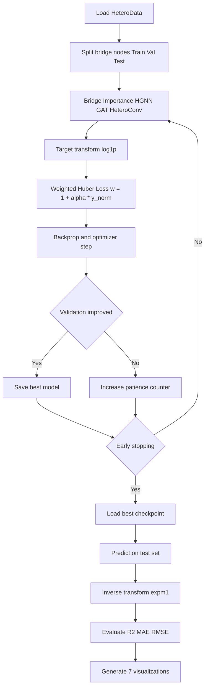
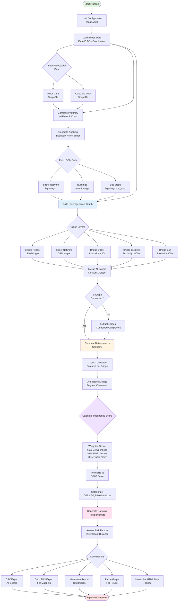

# Bridge Importance Scoring MVP

A v1.4-complete Infra2Graph prototype for bridge impact assessment in Yamaguchi City. The system integrates heterogeneous graph analysis and HGNN-based closure-impact prediction, with Exp-4-lite (`kNN=3`, no edge attributes, weak quantile-based weighting) adopted as the reference MVP configuration.

[](VERSION)
[](LICENSE)
[](https://www.python.org/downloads/)
[](https://networkx.org/)
[](CHANGELOG.md)

## Overview

This project leverages **heterogeneous graph networks** and **betweenness centrality** analysis to quantitatively assess bridge importance in urban infrastructure. By integrating multiple data layers (road networks, buildings, public facilities, bus stops, rivers, and coastlines), the system identifies critical bottleneck bridges whose loss would cause severe disruption to urban mobility.

### v1.2 Completion Update (2026-03-29)

The v1.2 closure-simulation workflow is now completed with reproducible outputs and visual analysis.

- Closure simulation target: 41 bridges (excluding `very_low`)
- Simulation result set: `output/closure_simulation_simple/closure_results.csv`
- Visualization set: 6 figures generated in `output/closure_simulation_simple/`
- Lessons learned document: `Lesson_closure_sim.md`

Key findings from v1.2 completion:
- The highest score bridge is not always the highest network-impact bridge.
- LOW category bridges include high-impact hubs in degree/component-split metrics.
- Multi-metric evaluation (BC + degree + component impact) is required for robust prioritization.

### v1.3 Completion Update (2026-03-29)

The v1.3 HGNN workflow for closure-impact prediction is completed.

- Closure indicators were computed for all 777 bridges in the largest connected component.
- Target variable was switched to `indirect_damage_score` for closure-impact prediction.
- HeteroData conversion was updated with bidirectional message passing (`street->bridge`, `bridge->street`).
- Training strategy was improved with `log1p` target transform, Huber loss, and weighted loss for high-score bridges.
- Seven analysis figures were generated for weighted training outputs.

Key findings from v1.3 completion:
- Weighted learning improved test performance from `R²=0.179` to `R²=0.288`.
- Test MAE improved from `3.38` to `3.20` and RMSE from `6.77` to `6.31`.
- High-impact bridges are still under-predicted, but prediction range expanded (`max pred 13.7`).

Release note:
- `releas_notes_v1.3.0.md`

### v1.4 Completion Update (2026-03-29)

The v1.4 experiment series is finalized as the **prototype of the Infra2Graph pipeline**.

- Prototype decision: **Exp-4-lite** is selected as the v1.4 reference configuration.
- Positioning: v1.4 defines the initial Infra2Graph design for bridge-to-street graph learning under noisy geospatial edge conditions.
- Evidence source: `output/v1_4_experiment_comparison/v1_4_experiment_comparison.csv`

**One-page comparison figure (edge information vs noise):**


Lesson document:
- `Lesson_edge_info_noise.md`

**Infra2Graph Prototype Edge Algorithm (v1.4):**
- Bridge-street edge construction uses `kNN (k=3)` instead of direct graph snap-only linkage.
- Edge attributes are treated as optional because distance-derived edge information can introduce noise depending on scaling.
- Training uses weak quantile-based weighting to preserve high-impact bridge sensitivity without destabilizing recall.

**Adopted v1.4 reference (Exp-4-lite):**
- `R²=0.3516`, `MAE=3.1347`, `RMSE=6.0203`, `Top-20 Recall=0.70`
- This outperforms Exp-1 baseline and provides better balance between global fit and top-risk bridge retrieval.

**Exp-4-lite Training Evidence:**


**Discussion from the two figures:**
- Training/validation curves show stable convergence with reduced overfitting risk under early stopping.
- Prediction scatter improves alignment with the diagonal compared to earlier v1.4 variants, supporting the selected configuration.
- High-impact samples are still somewhat under-predicted in the extreme tail, but ranking behavior is sufficiently preserved for top-risk retrieval (`Top-20 Recall=0.70`).

**Interpretation for Infra2Graph design:**
- Better edge topology (kNN linkage) consistently improved performance.
- More edge information is not always better; poorly scaled edge attributes can reduce recall.
- For the prototype stage, topology-first + conservative weighting is the most robust strategy.

### Key Features

🕸️ **Heterogeneous Graph Construction**
- Automated OSM (OpenStreetMap) data integration
- Multi-layer graph with bridges, streets, buildings, and POIs
- River and coastline proximity analysis

📊 **Centrality-Based Scoring**
- Betweenness centrality computation using NetworkX
- Weighted scoring considering public facility access and traffic volume
- Intuitive 0-100 score scale

📝 **Explainability**
- Human-readable narratives for each bridge
- Risk factor visualization (flood, salt damage)
- Detailed Markdown reports

### v1.1: HGNN Integration (新規)

🤖 **Heterogeneous Graph Neural Networks**
- PyTorch Geometric integration for deep learning
- HeteroConv + GATConv/SAGEConv models
- Bridge importance score prediction using GNN
- Multi-node-type feature learning (bridge, street, building)

**New Capabilities:**
- **Node Feature Engineering**: Health condition, age, environmental risks, structural attributes
- **Graph-based Learning**: Learn complex spatial relationships beyond traditional centrality
- **Predictive Modeling**: Train/test split with MAE, MSE, R² evaluation
- **Scalability**: Efficient training on heterogeneous graph data

### v1.3: Closure-Impact HGNN + Weighted Learning

🤖 **HGNN for closure impact (`indirect_damage_score`)**
- End-to-end pipeline from closure simulation indicators to HGNN regression
- Dynamic target selection in HeteroData converter (`target_column`)
- Weighted optimization to emphasize high-impact bridges

🧪 **Loss Function Engineering**
- `log1p` transformation on target to reduce long-tail skew
- Huber loss for robust optimization against outliers
- Sample-weighted loss: `weight = 1 + alpha * y_norm` (`alpha=3.0`)

📉 **Performance (Test Set)**
- Baseline: `R²=-0.056`, `MAE=4.77`, `RMSE=7.68`
- v1.3 improved: `R²=0.179`, `MAE=3.38`, `RMSE=6.77`
- v1.3 weighted: `R²=0.288`, `MAE=3.20`, `RMSE=6.31`

### v1.3 HGNN Flow (weighted training)



## Algorithm Flow



## Project Structure

```
bridge_importance_score/
├── 📄 config.yaml              # Configuration (paths, thresholds, weights)
├── 🚀 main.py                  # Main pipeline orchestrator
├── 📚 data_loader.py           # Data loading (bridges, rivers, coastline)
├── 🕸️ graph_builder.py         # Heterogeneous graph construction
├── 📊 centrality_scorer.py     # Centrality computation & scoring
├── 📝 narrative_generator.py   # Human-readable narrative generation
├── 📈 visualization.py         # Visualization (maps, charts)
├── 📈 visualize_closure_impact.py # [v1.2] Closure-impact visualization generator
├── 🧪 simple_closure_sim.py    # [v1.2] Robust closure simulation (largest CC based)
├── 🛠️ utils.py                 # Utilities & validation
├── ⚙️ setup_and_run.py         # Setup script
├── 📘 Lesson_closure_sim.md    # [v1.2] Lessons learned from closure simulation
├── 📋 requirements.txt         # Python dependencies
├── 📖 README_JP.md             # Japanese documentation
├── ⚡ QUICKSTART.md            # Quick start guide
└── data/                       # Data directory
    ├── Bridge_xy_location/     # Bridge list (Excel)
    ├── RiverDataKokudo/        # River data (Shapefile)
    └── KaigansenDataKokudo/    # Coastline data (Shapefile)
```

## Quick Start

### Prerequisites

- Python 3.8 or higher
- pip package manager

### Installation

```bash
# Clone the repository
git clone https://github.com/yourusername/bridge_importance_score.git
cd bridge_importance_score

# Create virtual environment (recommended)
python -m venv venv
source venv/bin/activate  # Windows: venv\Scripts\activate

# Install dependencies
pip install -r requirements.txt
```

### Data Preparation

Place the following data files in the `data/` directory:

1. **Bridge List**: `data/Bridge_xy_location/YamaguchiPrefBridgeListOpen251122_154891.xlsx`
   - Columns: Bridge ID, Name, Longitude, Latitude, Health Score
2. **River Data**: `data/RiverDataKokudo/W05-08_35_GML/` (Shapefile)
3. **Coastline Data**: `data/KaigansenDataKokudo/C23-06_35_GML/` (Shapefile)

### Run the Pipeline

```bash
# Option 1: Using setup script
python setup_and_run.py

# Option 2: Direct execution
python main.py
```

### v1.3: HGNN Training (closure-impact target)

After running the main pipeline, train the Heterogeneous GNN model:

```bash
# Step 1: Convert NetworkX graph to PyTorch Geometric HeteroData
python convert_to_heterodata.py

# Step 2: Train HGNN model (weighted)
python train_hgnn.py

# Step 3: Visualize weighted training results
python visualize_hgnn_results.py --result-dir output/hgnn_training_v1_3_weighted --baseline-metrics output/hgnn_training_v1_3/test_metrics.csv
```

**HGNN Training Output (v1.3):**
- `output/hgnn_training_v1_3_weighted/best_hgnn_model.pt` - Trained model weights
- `output/hgnn_training_v1_3_weighted/training_history.png` - Loss/MAE curves
- `output/hgnn_training_v1_3_weighted/predictions_vs_truth.png` - Prediction scatter plot
- `output/hgnn_training_v1_3_weighted/test_metrics.csv` - Evaluation metrics (MSE, MAE, R², RMSE)
- `output/hgnn_training_v1_3_weighted/visualization/` - 7 analysis figures

**Configuration:** Edit `config.yaml` under `hgnn:` section for hyperparameter tuning:
```yaml
hgnn:
  model_type: "standard"  # or "simple"
  target_column: "indirect_damage_score"
  hidden_channels: 128
  num_layers: 3
  conv_type: "GAT"  # or "SAGE"
  dropout: 0.3
  num_epochs: 300
  learning_rate: 0.001
  patience: 50
  use_log1p_target: true
  loss_function: "huber"
  use_weighted_loss: true
  weight_alpha: 3.0
```

### Expected Runtime

- Data loading: ~10 seconds
- Graph construction (OSM fetch): 3-5 minutes
- Centrality computation: 2-10 minutes (depends on graph size)
- Scoring & output: ~30 seconds

**Total: 5-15 minutes**

## Output Files

Results are saved to `output/bridge_importance/`:

| File | Description |
|------|-------------|
| `bridge_importance_scores.csv` | Complete scoring results (CSV) |
| `bridge_importance_scores.geojson` | Geographic data for mapping (GeoJSON) |
| `interactive_bridge_map.html` | Interactive web map (Folium) |
| `bridge_importance_report.md` | Detailed report with top bridges |
| `top10_critical_bridges.csv` | Top 10 critical bridges details |
| `heterogeneous_graph.pkl` | Saved graph object (Pickle) |
| `score_distribution.png` | Score distribution visualization |
| `v1_4_score_distribution.png` | v1.4 score distribution visualization |
| `v1_4_top20_bridges_map.png` | v1.4 top-20 bridge static map |
| `v1_4_interactive_bridge_map.html` | v1.4 interactive web map (Folium) |
| `metadata.yaml` | Execution metadata |

### v1.2 Closure Simulation Outputs

Results are saved to `output/closure_simulation_simple/`:

| File | Description |
|------|-------------|
| `closure_results.csv` | Closure impact metrics for 41 bridges |
| `closure_report.md` | Summary report for closure simulation |
| `summary_dashboard.png` | Integrated dashboard for impact analysis |
| `score_vs_degree.png` | Importance score vs network degree |
| `category_comparison.png` | Category-wise degree/component comparison |
| `top_bridges_degree.png` | Top 10 bridges by network degree |
| `component_impact.png` | Component increase impact analysis |
| `degree_distribution.png` | Degree distribution histogram |

Supplementary analysis document:
- `Lesson_closure_sim.md` (v1.2 lessons and recommendations)

### v1.3 HGNN Outputs

Results are saved to `output/hgnn_training_v1_3_weighted/`:

| File | Description |
|------|-------------|
| `best_hgnn_model.pt` | Best weighted HGNN model |
| `training_history.csv` | Epoch-wise train/validation history |
| `test_metrics.csv` | Test metrics (MSE, MAE, RMSE, R²) |
| `predictions_vs_truth.png` | Test prediction scatter |
| `visualization/fig1_training_curves.png` | Learning curves |
| `visualization/fig2_pred_vs_true.png` | Prediction vs truth (test + all) |
| `visualization/fig3_error_distribution.png` | Error histogram |
| `visualization/fig4_target_distribution.png` | Target distribution comparison |
| `visualization/fig5_top_bridges_ranking.png` | Top bridge ranking analysis |
| `visualization/fig6_residuals.png` | Residual diagnostics |
| `visualization/fig7_metrics_summary.png` | Summary dashboard |

## Visualization Results

The system generates comprehensive visualizations to explore v1.4 closure-impact scores (`indirect_damage_score`) and their spatial distribution.

### v1.4 Score Distribution Analysis


The v1.4 score distribution visualization provides four key insights:

1. **Importance Score Distribution (top-left)**: 
  - Shows a strongly right-skewed distribution (many low-impact bridges, few high-impact bridges)
  - Most bridges are concentrated at small `indirect_damage_score` values
  - Long tail indicates a small number of high-impact closure candidates

2. **Betweenness Centrality Distribution (top-right)**:
   - Logarithmic scale reveals power-law distribution
   - A small number of bridges have exceptionally high centrality values
   - Most bridges have relatively low centrality (< 0.05)

3. **Category Distribution (bottom-left)**:
  - Categories are assigned from normalized v1.4 score (`importance_score_100`) for map readability
  - The distribution is dominated by low/very-low bins, consistent with long-tail impact data
  - This confirms that a small subset of bridges drives disproportionate closure impact

4. **Centrality vs Score Correlation (bottom-right)**:
  - Relationship is positive but dispersed
  - Centrality alone does not fully explain closure impact
  - Supports using HGNN-based impact prediction rather than a single centrality metric

### v1.4 Top 20 Bridges Geographic Distribution


**Key Observations:**

- **Geographic Clustering**: Top-ranked bridges are spatially clustered along major urban corridors.

- **Strategic Locations**: High-impact bridges are often near:
  - Highway interchange access points
  - Major arterial road intersections
  - River crossing points

- **Color Gradient**: Yellow -> Red indicates increasing v1.4 impact score among top candidates.

- **Spatial Pattern**: Top bridges form a network backbone rather than isolated points, suggesting systematic bottleneck structure.

### v1.4 Interactive Web Map

The system generates a fully interactive HTML map using Folium (`v1_4_interactive_bridge_map.html`).

**Features:**
- 🗺️ **Pan & Zoom**: Explore all 791 bridges across Yamaguchi City
- 🎨 **Color-Coded Markers**: Green (low) → Yellow → Orange → Red (high importance)
- 📏 **Size-Scaled Icons**: Marker size proportional to v1.4 impact score
- 📋 **Rich Tooltips**: Click any bridge to view:
  - Bridge name, rank, and importance score
  - Betweenness centrality value
  - Nearby facilities (hospitals, schools, bus stops)
  - Distance to rivers and coastline
  - Risk assessment narrative

Open the v1.4 interactive map:

```bash
# Generate v1.4 visualization files
python run_visualization.py --mode v1_4 --top-n 20

# Open in browser (Windows PowerShell)
start "" "output/bridge_importance/v1_4_interactive_bridge_map.html"
```

### Generating Visualizations

To regenerate visualizations from existing results (legacy and v1.4):

```bash
# Legacy importance_score map
python run_visualization.py

# v1.4 closure-impact map
python run_visualization.py --mode v1_4 --top-n 20
```

This creates:
- `score_distribution.png` - Legacy statistical distribution charts
- `top20_bridges_map.png` - Legacy geographic map of top bridges
- `interactive_bridge_map.html` - Legacy interactive web map
- `v1_4_score_distribution.png` - v1.4 statistical distribution charts
- `v1_4_top20_bridges_map.png` - v1.4 geographic map of top bridges
- `v1_4_interactive_bridge_map.html` - v1.4 interactive web map (open in browser)

## Methodology

### Heterogeneous Graph Layers

The system constructs a 6-layer heterogeneous graph:

1. **Bridge Nodes** (1,316 bridges) - Evaluation targets
2. **Street Network** - OSM road network (`network_type='drive'`)
3. **Buildings** - Residential, hospitals, schools, public facilities
4. **Bus Stops** - Public transit nodes
5. **Rivers** - Flood risk assessment
6. **Coastline** - Salt damage risk assessment

### Scoring Formula

```
Importance Score = 0.6 × Betweenness Centrality Score
                 + 0.2 × Public Facility Access Score
                 + 0.2 × Traffic Volume Proxy Score
```

Normalized to 0-100 scale.

### Betweenness Centrality

Measures the fraction of shortest paths passing through each bridge node:

$$BC(v) = \sum_{s \neq v \neq t} \frac{\sigma_{st}(v)}{\sigma_{st}}$$

Where:
- $\sigma_{st}$ = total number of shortest paths from node $s$ to node $t$
- $\sigma_{st}(v)$ = number of those paths passing through $v$

## Configuration

Edit `config.yaml` to customize:

### Proximity Thresholds (meters)

```yaml
graph:
  proximity:
    bridge_to_street: 30      # Bridge-to-road snap distance
    bridge_to_building: 1000  # Bridge influence radius for buildings
    bridge_to_bus_stop: 800   # Bridge influence radius for bus stops
```

### Scoring Weights

```yaml
scoring:
  weights:
    betweenness: 0.6      # Betweenness centrality weight
    public_access: 0.2    # Public facility access weight
    traffic_volume: 0.2   # Traffic proxy weight
```

### Risk Thresholds

```yaml
narrative:
  risk:
    salt_damage_distance: 3000  # Coast proximity for salt damage (m)
    flood_risk: true            # Enable flood risk assessment
```

## Example Output

### Bridge Score (CSV)

| bridge_id | importance_rank | importance_score | category | betweenness | num_hospitals | narrative |
|-----------|----------------|------------------|----------|-------------|---------------|-----------|
| BR_0001   | 1              | 94.2             | critical | 0.0523      | 2             | **[Critical Bridge]** Top-tier bottleneck (Rank 1, Score 94.2)... |

### Narrative Example

> **[Critical Bridge]** Top-tier bottleneck (Rank 1, Score 94.2). This bridge is a major network junction where numerous traffic routes converge. Loss of this bridge would cause widespread disruption. Proximity to 5 public facilities indicates high social impact. Access route to 2 hospitals serves as critical emergency medical corridor. Spans a river with flood risk affecting urban connectivity. Located 1.2km from coastline with salt damage risk.

## Advanced Usage

### Load Saved Results

```python
from utils import load_saved_results
import yaml

# Load results
bridges, graph, metadata = load_saved_results('output/bridge_importance')

# Load config
with open('config.yaml', 'r', encoding='utf-8') as f:
    config = yaml.safe_load(f)
```

### Generate Visualizations

```python
from visualization import visualize_results

visualize_results(bridges, config)
```

### Compare Centrality Measures

```python
from utils import compare_centrality_measures

bridge_nodes = bridges['bridge_id'].tolist()
comparison = compare_centrality_measures(graph, bridge_nodes, limit=20)
```

### Export to GIS

```python
from utils import export_for_gis

# Shapefile format
export_for_gis(bridges, 'output/bridges.shp', format='shapefile')

# GeoPackage format (QGIS compatible)
export_for_gis(bridges, 'output/bridges.gpkg', format='gpkg')
```

## Troubleshooting

### OSM Data Fetch Timeout

Reduce the analysis area in `config.yaml`:

```yaml
data:
  osm:
    bbox:
      min_lon: 131.4  # Narrower bounds
      min_lat: 34.15
      max_lon: 131.5
      max_lat: 34.25
```

### Memory Issues

Enable approximate centrality computation:

```yaml
centrality:
  k: 100  # Limit to 100 sample nodes
```

### Coordinate System Errors

Verify Excel column names and adjust `data_loader.py`'s `_find_column()` method to match your data format.

## Extensibility

This MVP is designed for future extensions:

### Phase 2: HGNN (Heterogeneous Graph Neural Network)

- Graph structure ready for PyTorch Geometric
- Add bridge health scores as node features
- Predict future deterioration risk

### Phase 3: Dynamic Analysis

- Integrate real-time traffic data
- Disaster simulation (bridge closure impact)
- Maintenance budget optimization

### Phase 4: Multi-City Deployment

- Generalize to other municipalities
- Standardized data ingestion pipeline
- Cloud-based API service

## Technology Stack

- **Python**: 3.8+
- **NetworkX**: Graph analysis and centrality computation
- **GeoPandas**: Geospatial data processing
- **OSMnx**: OpenStreetMap data extraction
- **Folium**: Interactive web mapping
- **PyYAML**: Configuration management

## Contributing

Contributions are welcome! Please follow these steps:

1. Fork the repository
2. Create a feature branch (`git checkout -b feature/AmazingFeature`)
3. Commit your changes (`git commit -m 'Add some AmazingFeature'`)
4. Push to the branch (`git push origin feature/AmazingFeature`)
5. Open a Pull Request

## Citation

If you use this work in your research, please cite:

```bibtex
@software{bridge_importance_scoring_2024,
  title = {Bridge Importance Scoring MVP: Heterogeneous Graph Analysis for Urban Infrastructure},
  author = {Bridge Importance Scoring Project Team},
  year = {2024},
  url = {https://github.com/yourusername/bridge_importance_score}
}
```

## License

This project is licensed under the MIT License - see the [LICENSE](LICENSE) file for details.

## Data Sources

- **OpenStreetMap**: Road network, buildings, and POI data
- **Ministry of Land, Infrastructure, Transport and Tourism (MLIT)**: River and coastline data
- **Yamaguchi Prefecture Open Data**: Bridge inventory

## Acknowledgments

- NetworkX development team for graph analysis tools
- OSMnx contributors for OSM data integration
- GeoPandas community for geospatial processing capabilities

## Contact

For questions, issues, or collaboration inquiries:

- GitHub Issues: [Project Issues](https://github.com/yourusername/bridge_importance_score/issues)

---

**Version**: 1.0.0  
**Last Updated**: March 28, 2024  
**Status**: MVP Complete ✅

## 日本語版

詳細な日本語ドキュメントは [README_JP.md](README_JP.md) をご覧ください。
