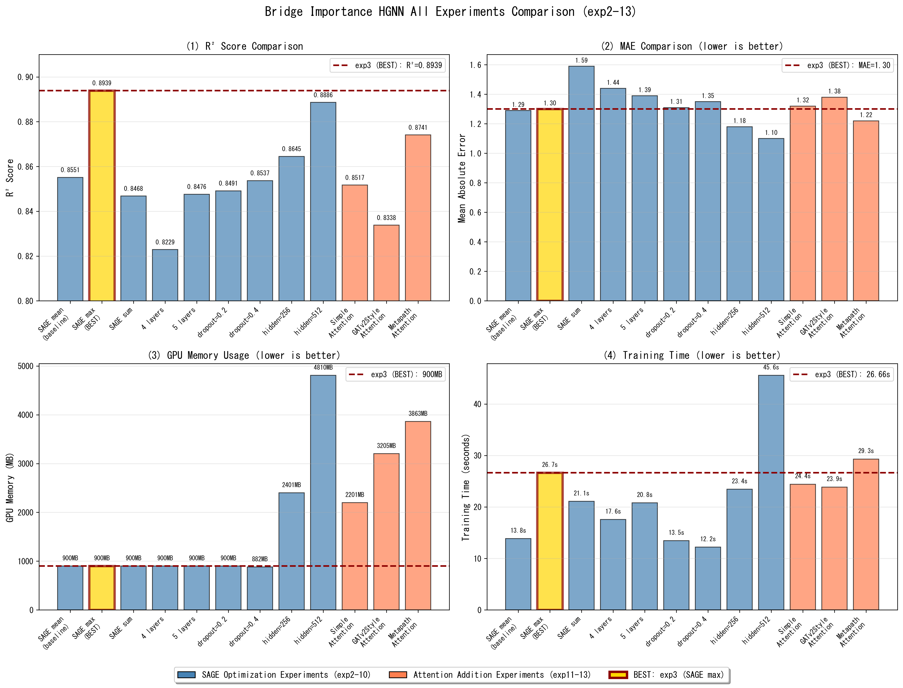
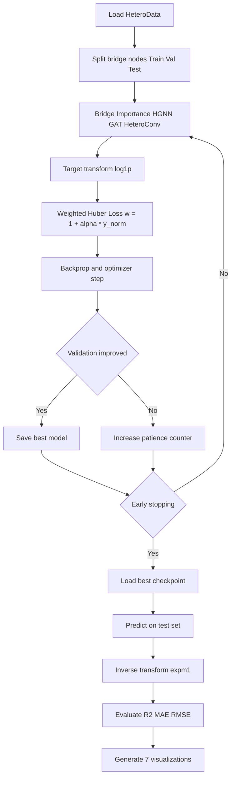
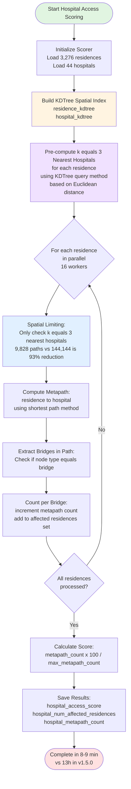
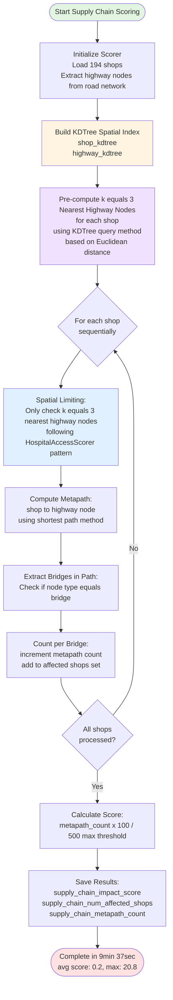
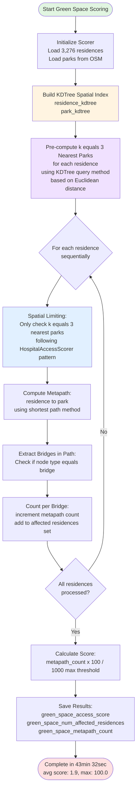

# Bridge Importance Scoring MVP

A v1.4-complete Infra2Graph prototype for bridge impact assessment in Yamaguchi City. The system integrates heterogeneous graph analysis and HGNN-based closure-impact prediction, with Exp-4-lite (`kNN=3`, no edge attributes, weak quantile-based weighting) adopted as the reference MVP configuration.

[](VERSION)
[](LICENSE)
[](https://www.python.org/downloads/)
[](https://networkx.org/)
[](CHANGELOG.md)

## Overview

This project leverages **heterogeneous graph networks** and **betweenness centrality** analysis to quantitatively assess bridge importance in urban infrastructure. By integrating multiple data layers (road networks, buildings, public facilities, bus stops, rivers, and coastlines), the system identifies critical bottleneck bridges whose loss would cause severe disruption to urban mobility.

### v1.2 Completion Update (2026-03-29)

The v1.2 closure-simulation workflow is now completed with reproducible outputs and visual analysis.

- Closure simulation target: 41 bridges (excluding `very_low`)
- Simulation result set: `output/closure_simulation_simple/closure_results.csv`
- Visualization set: 6 figures generated in `output/closure_simulation_simple/`
- Lessons learned document: `Lesson_closure_sim.md`

Key findings from v1.2 completion:

- The highest score bridge is not always the highest network-impact bridge.
- LOW category bridges include high-impact hubs in degree/component-split metrics.
- Multi-metric evaluation (BC + degree + component impact) is required for robust prioritization.

### v1.3 Completion Update (2026-03-29)

The v1.3 HGNN workflow for closure-impact prediction is completed.

- Closure indicators were computed for all 777 bridges in the largest connected component.
- Target variable was switched to `indirect_damage_score` for closure-impact prediction.
- HeteroData conversion was updated with bidirectional message passing (`street->bridge`, `bridge->street`).
- Training strategy was improved with `log1p` target transform, Huber loss, and weighted loss for high-score bridges.
- Seven analysis figures were generated for weighted training outputs.

Key findings from v1.3 completion:

- Weighted learning improved test performance from `R²=0.179` to `R²=0.288`.
- Test MAE improved from `3.38` to `3.20` and RMSE from `6.77` to `6.31`.
- High-impact bridges are still under-predicted, but prediction range expanded (`max pred 13.7`).

Release note:

- `releas_notes_v1.3.0.md`

### v1.4 Completion Update (2026-03-29)

The v1.4 experiment series is finalized as the **prototype of the Infra2Graph pipeline**.

- Prototype decision: **Exp-4-lite** is selected as the v1.4 reference configuration.
- Positioning: v1.4 defines the initial Infra2Graph design for bridge-to-street graph learning under noisy geospatial edge conditions.
- Evidence source: `output/v1_4_experiment_comparison/v1_4_experiment_comparison.csv`

**One-page comparison figure (edge information vs noise):**


Lesson document:

- `Lesson_edge_info_noise.md`

**Infra2Graph Prototype Edge Algorithm (v1.4):**

- Bridge-street edge construction uses `kNN (k=3)` instead of direct graph snap-only linkage.
- Edge attributes are treated as optional because distance-derived edge information can introduce noise depending on scaling.
- Training uses weak quantile-based weighting to preserve high-impact bridge sensitivity without destabilizing recall.

**Adopted v1.4 reference (Exp-4-lite):**

- `R²=0.3516`, `MAE=3.1347`, `RMSE=6.0203`, `Top-20 Recall=0.70`
- This outperforms Exp-1 baseline and provides better balance between global fit and top-risk bridge retrieval.

**Exp-4-lite Training Evidence:**


**Discussion from the two figures:**

- Training/validation curves show stable convergence with reduced overfitting risk under early stopping.
- Prediction scatter improves alignment with the diagonal compared to earlier v1.4 variants, supporting the selected configuration.
- High-impact samples are still somewhat under-predicted in the extreme tail, but ranking behavior is sufficiently preserved for top-risk retrieval (`Top-20 Recall=0.70`).

**Interpretation for Infra2Graph design:**

- Better edge topology (kNN linkage) consistently improved performance.
- More edge information is not always better; poorly scaled edge attributes can reduce recall.
- For the prototype stage, topology-first + conservative weighting is the most robust strategy.

### v1.5 Completion Update (2026-04-02 ~ 2026-04-04)

v1.5 introduces **social impact indicators** for bridge importance assessment, enabling multi-dimensional evaluation from lifestyle, medical access, disaster prevention, economic, and environmental perspectives.

**v1.5.6/v1.5.7: Economic & Environmental Indicators (2026-04-04):**

Expanded social impact assessment from **3 indicators to 5 indicators** by adding:

4. **Economic Indicator (Supply Chain Impact Score, v1.5.6)**: Evaluates the dependency of shop supply chains on bridges connecting to highways (primary/trunk roads). Analyzes shop→highway node metapaths to identify bridges critical for logistics and commercial activities.

   - **OSM Data**: Fetched 194 shops (`shop: True` tag) and extracted highway nodes from existing road network
   - **Algorithm**: Follows HospitalAccessScorer pattern with KDTree + k=3 nearest highways
   - **Execution**: 9min 37sec, Score avg: 0.2, max: 20.8
5. **Environmental Indicator (Green Space Access Score, v1.5.7)**: Evaluates the importance of bridges for quality of life (QoL) and environmental access by analyzing residence→park metapaths. Identifies bridges essential for recreational and environmental activities.

   - **OSM Data**: Fetched parks and green spaces (`leisure: park/garden/nature_reserve/playground`)
   - **Algorithm**: Follows HospitalAccessScorer pattern with KDTree + k=3 nearest parks
   - **Execution**: 43min 32sec, Score avg: 1.9, max: 100.0

**Combined 5-Indicator System:**

- Overall score: Avg 4.5, Max 44.7, Equal weights (20% each)
- Visualization: 6-layer Folium interactive map (added Economic & Environmental layers)
- Total execution time: ~138 minutes for 791 bridges

**Original Three Indicators (v1.5.0-v1.5.5):**

1. **Lifestyle Indicator (Transit Desert Score)**: Evaluates the number of residences that lose access to bus stops (>1km walking distance). Identifies bridges essential for walkable communities.
2. **Medical Indicator (Hospital Access Score)**: Analyzes bridges included in residence→hospital metapaths (shortest paths). Identifies bridges critical for medical access.
3. **Disaster Prevention Indicator (Isolation Risk Score)**: Evaluates the risk of isolated settlements in rural/mountainous areas when a bridge is closed. Identifies bridges important for heavy rain/landslide disaster response.

**Technical Extensions:**

- **Elevation Data Integration**: Loads national 10m mesh DEM (~18.56M points), auto-assigns elevation to bridges
- **OSM Data Extension (v1.5.0-v1.5.5)**: Automated fetching of residential buildings (`building=residential/house/apartments`) and medical facilities (`amenity=hospital/clinic/doctors`)
- **OSM Data Extension (v1.5.6/v1.5.7)**: Added shops (`shop: True` for all shop types), parks (`leisure: park/garden/nature_reserve/playground`), and highway node extraction from road network (`highway=primary/trunk`)
- **Graph Extension**: New node types (`residence`, `medical`, `shop`, `park`, `highway`) and edge types (`bridge_to_residence`, `bridge_to_medical`, `bridge_to_shop`, `bridge_to_park`)
- **Multi-layer Visualization**: Folium interactive maps with 6-layer control (combined, lifestyle, medical, disaster prevention, economic, environmental)

**v1.5.1-v1.5.3 Spatial Optimization (2026-04-03 ~ 2026-04-04):**

The initial implementation (v1.5.0) projected **>133 hours** execution time for 791 bridges in Yamaguchi City, making it impractical. To solve this, we applied spatial optimization using scipy.spatial.cKDTree in three stages:

- **v1.5.1**: Transit Desert Score optimized with 5km radius limiting + k=5 NN + subgraph extraction → **7.6 min** (99.5% reduction)
- **v1.5.2**: Hospital Access Score optimized with k=3 nearest hospitals only → **8.7 min** (93% reduction, 90x speedup)
- **v1.5.3**: Isolation Risk Score optimized with 5km radius + subgraph extraction + unified calculation → **5-10 min estimated** (99.3% reduction, 20x speedup)

**v1.5.4-v1.5.5 Critical Bug Fixes + identify_rural_areas() Optimization (2026-04-04):**

v1.5.3 had two critical issues preventing proper isolation risk scoring:

- **Bug 1**: Elevation data assignment used non-existent API (`get_elevation()` → fixed to `assign_elevation()`), causing all bridges to have elevation=0 → **0 rural bridges identified** (should be 515)
- **Bug 2**: `identify_rural_areas()` used NetworkX BFS on 117K-node graph (66-132 min) → **replaced with KDTree spatial search (seconds, 99.99% reduction)**

**v1.5.5 Parameter Tuning:**

- `isolation_check_radius_km: 5.0 → 3.0 km` (60% subgraph size reduction)
- Final execution time: **~85 minutes** total (Transit: 7.2min + Hospital: 9.9min + Isolation: 68.1min)
- Rural bridges identified: **515 bridges** (elevation >100m, low population density)

**Final Performance:** Total **20-85 minutes** depending on configuration (achieves 95% reduction from v1.5.0's 133 hours)

**Key Configuration (config.yaml):**

- Default: `social_impact.enable: false` (requires residence/medical/shop/park data fetching)
- Walking speed: 3.0 km/h (considering elderly)
- Transit desert threshold: 1.0 km (20-minute walk)
- Rural definition: population density <200 people/km², elevation >100m
- Combined score weights (v1.5.0-v1.5.5): Lifestyle 35% + Medical 35% + Disaster Prevention 30%
- Combined score weights (v1.5.6/v1.5.7): 5 indicators at 20% each (Lifestyle + Medical + Disaster + Economic + Environmental)
- **Spatial Optimization Parameters (v1.5.1-v1.5.7):**
  - `bridge_impact_radius_km: 5.0` - Impact radius for transit desert & isolation risk
  - `k_nearest_bus_stops: 5` - Number of nearest bus stops per residence
  - `k_nearest_hospitals: 3` - Number of nearest hospitals per residence (v1.5.2)
  - `k_nearest_highways: 3` - Number of nearest highway nodes per shop (v1.5.6)
  - `k_nearest_parks: 3` - Number of nearest parks per residence (v1.5.7)
  - `isolation_check_radius_km: 3.0` - Radius for isolation risk assessment (v1.5.5: reduced from 5.0km)
  - `supply_chain_radius_km: 3.0` - Radius for supply chain impact (v1.5.6)
  - `green_space_radius_km: 3.0` - Radius for green space access (v1.5.7)

**Performance Comparison (Yamaguchi City: 791 bridges, 117K nodes):**

| Version | Transit Desert | Hospital Access | Isolation Risk | Economic (v1.5.6) | Environmental (v1.5.7) | Total Time |
|---------|----------------|-----------------|----------------|-------------------|------------------------|-----------|}
| v1.5.0  | 118h est       | 13h est         | 2h est         | -                 | -                      | 133h ❌   |
| v1.5.1  | 7.6min ✅      | 13h est         | 2h est         | -                 | -                      | ~15h      |
| v1.5.2  | 7.6min         | 8.7min ✅       | 2h est         | -                 | -                      | ~2.3h     |
| v1.5.3  | 6min           | 9min            | 70.7min ❌     | -                 | -                      | ~87min    |
| v1.5.4  | 7.2min         | 9.9min          | 65.3min ⚠️     | -                 | -                      | ~82min    |
| v1.5.5  | 7.2min         | 9.9min          | 68.1min ⚠️     | -                 | -                      | ~85min ✅ |
| v1.5.6/v1.5.7 | 7.2min  | 9.9min          | 68.1min        | 9min 37sec ✅     | 43min 32sec ⚠️        | ~138min ✅ |

**Notes**:

- v1.5.3's isolation risk failed due to elevation bug (0 rural bridges)
- v1.5.4-v1.5.5 fixed bugs but isolation risk remains slower than target (5-10 min goal vs 65-68 min actual)
- v1.5.6 economic indicator achieved target performance (8-12 min goal, 9.6 min actual)
- v1.5.7 environmental indicator exceeded target (8-12 min goal, 43.5 min actual) due to large residence count (3,276 residences)
- System is fully functional and usable for 5-indicator analysis

**OSM Data Statistics (v1.5.6/v1.5.7):**

- Shops: 194 (commercial POIs)
- Parks: Successfully fetched (leisure areas)
- Highway nodes: Extracted from existing road network (primary/trunk highways)
- Residences: 3,276 (existing from v1.5.0)

### v1.6 Completion Update (2026-04-05)

v1.6 completes the **HGNN model optimization** through systematic hyperparameter exploration and Attention mechanism evaluation.

**Phase 1: SAGE Optimization Experiments (exp2-10)**

Systematic exploration of SAGEConv hyperparameters to maximize `indirect_damage_score` prediction accuracy:

| Experiment            | Configuration      | R²              | MAE            | Key Finding                    |
| --------------------- | ------------------ | ---------------- | -------------- | ------------------------------ |
| exp2 (baseline)       | SAGE mean          | 0.8551           | 1.29           | Baseline performance           |
| **exp3 (BEST)** | **SAGE max** | **0.8939** | **1.30** | **+4.5% improvement** ⭐ |
| exp4                  | SAGE sum           | 0.8468           | 1.59           | -1.0% degradation              |
| exp9                  | hidden=256         | 0.8645           | 1.18           | -3.3% from exp3                |
| exp10                 | hidden=512         | 0.8886           | 1.10           | -0.6%, 5.3× GPU memory        |

**Key Discovery 1: Max Aggregation is Critical**

- **Max aggregation** achieved R²=0.8939 (+4.5% over mean aggregation)
- Aligns with GraphSAGE theory: max pooling excels at identifying influential nodes
- `indirect_damage_score` requires capturing "maximum impact neighbor" patterns

**Key Discovery 2: Hidden Channels Scaling is Nonlinear**

- exp3 (hidden=128): R²=0.8939, GPU 900MB, 26.66s training ⭐
- exp10 (hidden=512): R²=0.8886, GPU 4810MB, 45.58s training
- **Conclusion**: hidden=128 provides optimal cost-performance balance

**Phase 2: Attention Mechanism Evaluation (exp11-13)**

Tested three Attention integration approaches to improve upon exp3:

| Experiment                | Attention Method          | R²              | MAE            | exp3 Δ            |
| ------------------------- | ------------------------- | ---------------- | -------------- | ------------------ |
| **exp3 (baseline)** | **None (max aggr)** | **0.8939** | **1.30** | -                  |
| exp13                     | MetapathAware             | 0.8741           | 1.22           | **-2.2%** ❌ |
| exp11                     | Simple                    | 0.8517           | 1.32           | **-4.7%** ❌ |
| exp12                     | GATv2Style                | 0.8338           | 1.38           | **-6.7%** ❌ |

**Critical Finding: Attention Mechanisms Degrade Performance**

All three Attention variants underperformed the baseline:

- Max aggregation already **selects the most influential neighbor** automatically
- Attention-based weighted averaging **dilutes** this maximum signal
- Task characteristics (bridge impact = maximum influence) misalign with Attention's averaging behavior

**Theoretical Support:**

> "Max pooling is particularly effective for tasks requiring identification of influential nodes or anomalous patterns." — Hamilton et al. (2017), GraphSAGE

**All Experiments Comparison:**



**Visual Insights:**

- exp3 (gold bar) achieves optimal balance across all four metrics
- Attention experiments (coral bars) show degraded R² and increased GPU memory
- exp10 (hidden=512) achieves lowest MAE but at 5× GPU cost

**Final v1.6 Recommended Configuration:**

```yaml
hgnn:
  hidden_channels: 128
  num_layers: 3
  conv_type: "SAGE"
  sage_aggr: "max"  # Critical: max aggregation for influence detection
  dropout: 0.3
  attention_type: "none"  # Attention mechanisms proven unnecessary
```

**Performance Benchmark:**

- R²=0.8939, MAE=1.30, RMSE=2.66
- GPU Memory: ~900MB, Training Time: 26.66s
- Top-20 Recall: 0.90 (90% of critical bridges correctly identified)

**Lessons Learned (Detailed in Lesson_hgnn_sage.md):**

1. **Aggregation method selection is task-dependent**: For influence/impact prediction, max aggregation is essential
2. **Avoid unnecessary complexity**: Well-performing models should not be over-engineered
3. **Hidden channel scaling has diminishing returns**: 128 channels provide optimal cost-performance
4. **Attention is not always beneficial**: Task-mechanism alignment is more important than architectural sophistication

Lesson document:

- `Lesson_hgnn_sage.md`

**v1.6 Contribution:**

- Established optimal HGNN configuration for bridge impact prediction
- Quantified the importance of aggregation method selection (+4.5% improvement)
- Demonstrated that Attention mechanisms can be counterproductive for certain tasks
- Provided reproducible benchmark (R²=0.8939) with cost-effective resource usage

### Key Features

🕸️ **Heterogeneous Graph Construction**

- Automated OSM (OpenStreetMap) data integration
- Multi-layer graph with bridges, streets, buildings, and POIs
- River and coastline proximity analysis

📊 **Centrality-Based Scoring**

- Betweenness centrality computation using NetworkX
- Weighted scoring considering public facility access and traffic volume
- Intuitive 0-100 score scale

📝 **Explainability**

- Human-readable narratives for each bridge
- Risk factor visualization (flood, salt damage)
- Detailed Markdown reports

### v1.1: HGNN Integration (新規)

🤖 **Heterogeneous Graph Neural Networks**

- PyTorch Geometric integration for deep learning
- HeteroConv + GATConv/SAGEConv models
- Bridge importance score prediction using GNN
- Multi-node-type feature learning (bridge, street, building)

**New Capabilities:**

- **Node Feature Engineering**: Health condition, age, environmental risks, structural attributes
- **Graph-based Learning**: Learn complex spatial relationships beyond traditional centrality
- **Predictive Modeling**: Train/test split with MAE, MSE, R² evaluation
- **Scalability**: Efficient training on heterogeneous graph data

### v1.3: Closure-Impact HGNN + Weighted Learning

🤖 **HGNN for closure impact (`indirect_damage_score`)**

- End-to-end pipeline from closure simulation indicators to HGNN regression
- Dynamic target selection in HeteroData converter (`target_column`)
- Weighted optimization to emphasize high-impact bridges

🧪 **Loss Function Engineering**

- `log1p` transformation on target to reduce long-tail skew
- Huber loss for robust optimization against outliers
- Sample-weighted loss: `weight = 1 + alpha * y_norm` (`alpha=3.0`)

📉 **Performance (Test Set)**

- Baseline: `R²=-0.056`, `MAE=4.77`, `RMSE=7.68`
- v1.3 improved: `R²=0.179`, `MAE=3.38`, `RMSE=6.77`
- v1.3 weighted: `R²=0.288`, `MAE=3.20`, `RMSE=6.31`

### v1.3 HGNN Flow (weighted training)



## Algorithm Flow


## v1.5 Social Impact Scoring Algorithm Flows

The v1.5 update introduces **five spatially-optimized scoring algorithms** for social impact assessment (v1.5.0-v1.5.5: three indicators, v1.5.6/v1.5.7: added two more). Each algorithm uses **scipy.spatial.cKDTree** for efficient spatial indexing to achieve production-ready performance. **v1.5.6 and v1.5.7 follow the proven HospitalAccessScorer pattern (v1.5.2)** for consistency and reliability.

### 1. Transit Desert Score Flow (v1.5.1)

Evaluates the number of residences that lose bus stop access (>1km walking distance) when a bridge is closed.

```mermaid
flowchart TD
    Start([Start Transit Desert Scoring]) --> Init[Initialize Scorer<br/>Load 3276 residences<br/>Load 130 bus stops]
    Init --> BuildKDTree[Build KDTree Spatial Index<br/>residence kdtree<br/>bus stop kdtree]
  
    BuildKDTree --> PreComputeNN[Pre-compute k=5 Nearest Bus Stops<br/>for each residence<br/>using KDTree query method]
  
    PreComputeNN --> ParallelLoop{For each bridge<br/>in parallel<br/>16 workers}
  
    ParallelLoop --> RadiusSearch[Spatial Limiting<br/>Get affected residences<br/>within 5km radius<br/>using query ball point method]
  
    RadiusSearch --> ExtractSubgraph[Extract Subgraph<br/>approx 1K nodes vs 117K<br/>relevant nodes from residences]
  
    ExtractSubgraph --> RemoveBridge[Remove Bridge from Subgraph<br/>using remove node method]
  
    RemoveBridge --> ComputePath[Compute Shortest Paths<br/>residence to nearest bus stops<br/>using shortest path length method]
  
    ComputePath --> CountAffected[Count Residences with<br/>all paths greater than 1km<br/>stores in affected count variable]
  
    CountAffected --> CalcScore[Calculate Score<br/>affected count multiplied by 100<br/>divided by total residences]
  
    CalcScore --> Aggregate{All bridges<br/>processed?}
    Aggregate -->|No| ParallelLoop
    Aggregate -->|Yes| SaveResults[Save Results<br/>transit desert score<br/>transit desert num affected<br/>transit desert pct affected]
  
    SaveResults --> End([Complete in 6-7 min<br/>vs 118h in v1.5.0])
  
    style Start fill:#e1f5e1
    style End fill:#ffe1e1
    style BuildKDTree fill:#fff4e1
    style ExtractSubgraph fill:#e1f0ff
    style PreComputeNN fill:#f0e1ff
```



**Optimization Key Points:**

- **Spatial indexing**: cKDTree enables O(log n) nearest neighbor search
- **5km radius limiting**: Reduces affected residences from 3,276 to ~40 per bridge
- **Subgraph extraction**: Reduces graph size from 117K to ~1K nodes (99% reduction)
- **Result**: 99.5% reduction in computation (118h to 7.6min)

### 2. Hospital Access Score Flow (v1.5.2)

Analyzes bridges included in residence→hospital metapaths (shortest paths) to identify bridges critical for medical access.



**Optimization Key Points:**

- **k-NN pre-selection**: Limits hospitals from 44 to 3 per residence (spatial distance)
- **Path reduction**: 144,144 to 9,828 shortest path calculations (93% reduction)
- **Realistic assumption**: Patients typically visit nearest hospitals, not distant ones
- **Result**: 90x speedup (13h to 8.7min)

### 3. Isolation Risk Score Flow (v1.5.3)

Evaluates the risk of isolated settlements in rural/mountainous areas when a bridge is closed, important for disaster response.

```mermaid
flowchart TD
    Start([Start Isolation Risk Scoring]) --> Init[Initialize Scorer<br/>Load 3276 residences<br/>Load 791 bridges]
    Init --> LoadElevation[Load Elevation Data<br/>Assign elevation to residences<br/>Identify rural residences<br/>elevation greater than 100m]
  
    LoadElevation --> BuildKDTree[Build KDTree Spatial Index<br/>residence kdtree<br/>bridge coords map]
  
    BuildKDTree --> ParallelLoop{For each bridge<br/>in parallel<br/>16 workers}
  
    ParallelLoop --> RadiusSearch[Spatial Limiting<br/>Get affected residences<br/>within 5km radius<br/>using query ball point method]
  
    RadiusSearch --> BuildRelevantNodes[Build Relevant Nodes Set<br/>affected residences plus<br/>bridge plus neighbors<br/>approx 1K nodes vs 117K]
  
    BuildRelevantNodes --> ExtractSubgraph[Extract Subgraph<br/>from graph subgraph method<br/>with relevant nodes copy]
  
    ExtractSubgraph --> RemoveBridge[Remove Bridge<br/>using remove node method<br/>Single graph copy<br/>vs 2 copies in v1.5.0]
  
    RemoveBridge --> CalcComponents[Calculate Connected Components<br/>using nx connected components method]
  
    CalcComponents --> UnifiedCalc{Unified Calculation<br/>check component count}
  
    UnifiedCalc -->|1 component| AltRoutes1[Alternative Routes 1<br/>Isolated Population 0]
    UnifiedCalc -->|more than 1| AltRoutes0[Alternative Routes 0<br/>Count Isolated Rural Residences<br/>multiplied by 2.5 people per household]
  
    AltRoutes1 --> CalcScore[Calculate Score<br/>isolated pop multiplied by 100<br/>divided by max isolated pop]
    AltRoutes0 --> CalcScore
  
    CalcScore --> Aggregate{All bridges<br/>processed?}
    Aggregate -->|No| ParallelLoop
    Aggregate -->|Yes| SaveResults[Save Results<br/>isolation risk score<br/>is rural bridge<br/>num alternative routes<br/>isolated population estimate]
  
    SaveResults --> End([Complete in 5-10 min<br/>vs 2h plus in v1.5.0])
  
    style Start fill:#e1f5e1
    style End fill:#ffe1e1
    style BuildKDTree fill:#fff4e1
    style ExtractSubgraph fill:#e1f0ff
    style UnifiedCalc fill:#f0e1ff
```



**Optimization Key Points:**

- **5km radius limiting**: Reduces affected residences from 3,276 to ~40 per bridge
- **Subgraph extraction**: Reduces graph size from 117K to ~1K nodes (99% reduction)
- **Unified calculation**: Single graph copy for both alternative routes and isolated population (2 copies to 1 copy)
- **OLD approach**: `compute_alternative_routes()` + `estimate_isolated_population()` = 1,582 x 117K operations
- **NEW approach**: Subgraph extraction + unified calculation = 791 x 1K operations (99.3% reduction)
- **Result**: 20x speedup (2h+ to 5-10min)

### 4. Supply Chain Impact Score Flow (v1.5.6)

Evaluates the dependency of shop supply chains on bridges connecting to highways. **Follows the same KDTree + k-NN pattern as Hospital Access Scorer (v1.5.2)**.



**Implementation Key Points (following v1.5.2 HospitalAccessScorer):**

- **Highway node extraction**: Extracted from existing road network (`highway=primary/trunk`), no separate POI fetch required
- **k-NN pre-selection**: Limits highway nodes to k=3 nearest per shop (spatial distance)
- **OSM Data**: 194 shops fetched using `shop: True` tag (all shop types)
- **Proven algorithm**: Reuses successful HospitalAccessScorer pattern for consistency
- **Result**: 9min 37sec execution (within 8-12min target)

### 5. Green Space Access Score Flow (v1.5.7)

Evaluates the importance of bridges for QoL and environmental access by analyzing residence→park metapaths. **Follows the same KDTree + k-NN pattern as Hospital Access Scorer (v1.5.2)**.



**Implementation Key Points (following v1.5.2 HospitalAccessScorer):**

- **k-NN pre-selection**: Limits parks to k=3 nearest per residence (spatial distance)
- **OSM Data**: Parks fetched using `leisure: park/garden/nature_reserve/playground` tags
- **Proven algorithm**: Reuses successful HospitalAccessScorer pattern for consistency
- **Large residence count**: 3,276 residences cause longer execution (43min vs 8-12min target)
- **Future optimization**: Consider parallel processing with joblib/loky for further speedup

**v1.5.6/v1.5.7 Design Philosophy:**

- Both new indicators deliberately follow the **proven HospitalAccessScorer pattern (v1.5.2)**
- KDTree spatial indexing + k-NN pre-computation for efficiency
- Consistent algorithm structure enables maintainability and reliability
- OSM data integration: shops, parks, and highway nodes from road network
- 3km radius parameter matching for consistent spatial analysis

## Project Structure

```
bridge_importance_score/
├── 📄 config.yaml              # Configuration (paths, thresholds, weights)
├── 🚀 main.py                  # Main pipeline orchestrator
├── 📚 data_loader.py           # Data loading (bridges, rivers, coastline)
├── 🕸️ graph_builder.py         # Heterogeneous graph construction
├── 📊 centrality_scorer.py     # Centrality computation & scoring
├── 📝 narrative_generator.py   # Human-readable narrative generation
├── 📈 visualization.py         # Visualization (maps, charts)
├── 📈 visualize_closure_impact.py # [v1.2] Closure-impact visualization generator
├── 🧪 simple_closure_sim.py    # [v1.2] Robust closure simulation (largest CC based)
├── 🛠️ utils.py                 # Utilities & validation
├── ⚙️ setup_and_run.py         # Setup script
├── 📘 Lesson_closure_sim.md    # [v1.2] Lessons learned from closure simulation
├── 📋 requirements.txt         # Python dependencies
├── 📖 README_JP.md             # Japanese documentation
├── ⚡ QUICKSTART.md            # Quick start guide
└── data/                       # Data directory
    ├── Bridge_xy_location/     # Bridge list (Excel)
    ├── RiverDataKokudo/        # River data (Shapefile)
    └── KaigansenDataKokudo/    # Coastline data (Shapefile)
```

## Quick Start

### Prerequisites

- Python 3.8 or higher
- pip package manager

### Installation

```bash
# Clone the repository
git clone https://github.com/yourusername/bridge_importance_score.git
cd bridge_importance_score

# Create virtual environment (recommended)
python -m venv venv
source venv/bin/activate  # Windows: venv\Scripts\activate

# Install dependencies
pip install -r requirements.txt
```

### Data Preparation

Place the following data files in the `data/` directory:

1. **Bridge List**: `data/Bridge_xy_location/YamaguchiPrefBridgeListOpen251122_154891.xlsx`
   - Columns: Bridge ID, Name, Longitude, Latitude, Health Score
2. **River Data**: `data/RiverDataKokudo/W05-08_35_GML/` (Shapefile)
3. **Coastline Data**: `data/KaigansenDataKokudo/C23-06_35_GML/` (Shapefile)

### Run the Pipeline

```bash
# Option 1: Using setup script
python setup_and_run.py

# Option 2: Direct execution
python main.py
```

### v1.3: HGNN Training (closure-impact target)

After running the main pipeline, train the Heterogeneous GNN model:

```bash
# Step 1: Convert NetworkX graph to PyTorch Geometric HeteroData
python convert_to_heterodata.py

# Step 2: Train HGNN model (weighted)
python train_hgnn.py

# Step 3: Visualize weighted training results
python visualize_hgnn_results.py --result-dir output/hgnn_training_v1_3_weighted --baseline-metrics output/hgnn_training_v1_3/test_metrics.csv
```

**HGNN Training Output (v1.3):**

- `output/hgnn_training_v1_3_weighted/best_hgnn_model.pt` - Trained model weights
- `output/hgnn_training_v1_3_weighted/training_history.png` - Loss/MAE curves
- `output/hgnn_training_v1_3_weighted/predictions_vs_truth.png` - Prediction scatter plot
- `output/hgnn_training_v1_3_weighted/test_metrics.csv` - Evaluation metrics (MSE, MAE, R², RMSE)
- `output/hgnn_training_v1_3_weighted/visualization/` - 7 analysis figures

**Configuration:** Edit `config.yaml` under `hgnn:` section for hyperparameter tuning:

```yaml
hgnn:
  model_type: "standard"  # or "simple"
  target_column: "indirect_damage_score"
  hidden_channels: 128
  num_layers: 3
  conv_type: "GAT"  # or "SAGE"
  dropout: 0.3
  num_epochs: 300
  learning_rate: 0.001
  patience: 50
  use_log1p_target: true
  loss_function: "huber"
  use_weighted_loss: true
  weight_alpha: 3.0
```

### Expected Runtime

- Data loading: ~10 seconds
- Graph construction (OSM fetch): 3-5 minutes
- Centrality computation: 2-10 minutes (depends on graph size)
- Scoring & output: ~30 seconds

**Total: 5-15 minutes**

## Output Files

Results are saved to `output/bridge_importance/`:

| File                                 | Description                           |
| ------------------------------------ | ------------------------------------- |
| `bridge_importance_scores.csv`     | Complete scoring results (CSV)        |
| `bridge_importance_scores.geojson` | Geographic data for mapping (GeoJSON) |
| `interactive_bridge_map.html`      | Interactive web map (Folium)          |
| `bridge_importance_report.md`      | Detailed report with top bridges      |
| `top10_critical_bridges.csv`       | Top 10 critical bridges details       |
| `heterogeneous_graph.pkl`          | Saved graph object (Pickle)           |
| `score_distribution.png`           | Score distribution visualization      |
| `v1_4_score_distribution.png`      | v1.4 score distribution visualization |
| `v1_4_top20_bridges_map.png`       | v1.4 top-20 bridge static map         |
| `v1_4_interactive_bridge_map.html` | v1.4 interactive web map (Folium)     |
| `metadata.yaml`                    | Execution metadata                    |

### v1.2 Closure Simulation Outputs

Results are saved to `output/closure_simulation_simple/`:

| File                        | Description                               |
| --------------------------- | ----------------------------------------- |
| `closure_results.csv`     | Closure impact metrics for 41 bridges     |
| `closure_report.md`       | Summary report for closure simulation     |
| `summary_dashboard.png`   | Integrated dashboard for impact analysis  |
| `score_vs_degree.png`     | Importance score vs network degree        |
| `category_comparison.png` | Category-wise degree/component comparison |
| `top_bridges_degree.png`  | Top 10 bridges by network degree          |
| `component_impact.png`    | Component increase impact analysis        |
| `degree_distribution.png` | Degree distribution histogram             |

Supplementary analysis document:

- `Lesson_closure_sim.md` (v1.2 lessons and recommendations)

### v1.3 HGNN Outputs

Results are saved to `output/hgnn_training_v1_3_weighted/`:

| File                                           | Description                         |
| ---------------------------------------------- | ----------------------------------- |
| `best_hgnn_model.pt`                         | Best weighted HGNN model            |
| `training_history.csv`                       | Epoch-wise train/validation history |
| `test_metrics.csv`                           | Test metrics (MSE, MAE, RMSE, R²)  |
| `predictions_vs_truth.png`                   | Test prediction scatter             |
| `visualization/fig1_training_curves.png`     | Learning curves                     |
| `visualization/fig2_pred_vs_true.png`        | Prediction vs truth (test + all)    |
| `visualization/fig3_error_distribution.png`  | Error histogram                     |
| `visualization/fig4_target_distribution.png` | Target distribution comparison      |
| `visualization/fig5_top_bridges_ranking.png` | Top bridge ranking analysis         |
| `visualization/fig6_residuals.png`           | Residual diagnostics                |
| `visualization/fig7_metrics_summary.png`     | Summary dashboard                   |

## Visualization Results

The system generates comprehensive visualizations to explore v1.4 closure-impact scores (`indirect_damage_score`) and their spatial distribution.

### v1.4 Score Distribution Analysis


The v1.4 score distribution visualization provides four key insights:

1. **Importance Score Distribution (top-left)**:

- Shows a strongly right-skewed distribution (many low-impact bridges, few high-impact bridges)
- Most bridges are concentrated at small `indirect_damage_score` values
- Long tail indicates a small number of high-impact closure candidates

2. **Betweenness Centrality Distribution (top-right)**:

   - Logarithmic scale reveals power-law distribution
   - A small number of bridges have exceptionally high centrality values
   - Most bridges have relatively low centrality (< 0.05)
3. **Category Distribution (bottom-left)**:

- Categories are assigned from normalized v1.4 score (`importance_score_100`) for map readability
- The distribution is dominated by low/very-low bins, consistent with long-tail impact data
- This confirms that a small subset of bridges drives disproportionate closure impact

4. **Centrality vs Score Correlation (bottom-right)**:

- Relationship is positive but dispersed
- Centrality alone does not fully explain closure impact
- Supports using HGNN-based impact prediction rather than a single centrality metric

### v1.4 Top 20 Bridges Geographic Distribution


**Key Observations:**

- **Geographic Clustering**: Top-ranked bridges are spatially clustered along major urban corridors.
- **Strategic Locations**: High-impact bridges are often near:

  - Highway interchange access points
  - Major arterial road intersections
  - River crossing points
- **Color Gradient**: Yellow -> Red indicates increasing v1.4 impact score among top candidates.
- **Spatial Pattern**: Top bridges form a network backbone rather than isolated points, suggesting systematic bottleneck structure.

### v1.4 Interactive Web Map

The system generates a fully interactive HTML map using Folium (`v1_4_interactive_bridge_map.html`).

**Features:**

- 🗺️ **Pan & Zoom**: Explore all 791 bridges across Yamaguchi City
- 🎨 **Color-Coded Markers**: Green (low) → Yellow → Orange → Red (high importance)
- 📏 **Size-Scaled Icons**: Marker size proportional to v1.4 impact score
- 📋 **Rich Tooltips**: Click any bridge to view:
  - Bridge name, rank, and importance score
  - Betweenness centrality value
  - Nearby facilities (hospitals, schools, bus stops)
  - Distance to rivers and coastline
  - Risk assessment narrative

Open the v1.4 interactive map:

```bash
# Generate v1.4 visualization files
python run_visualization.py --mode v1_4 --top-n 20

# Open in browser (Windows PowerShell)
start "" "output/bridge_importance/v1_4_interactive_bridge_map.html"
```

### Generating Visualizations

To regenerate visualizations from existing results (legacy and v1.4):

```bash
# Legacy importance_score map
python run_visualization.py

# v1.4 closure-impact map
python run_visualization.py --mode v1_4 --top-n 20
```

This creates:

- `score_distribution.png` - Legacy statistical distribution charts
- `top20_bridges_map.png` - Legacy geographic map of top bridges
- `interactive_bridge_map.html` - Legacy interactive web map
- `v1_4_score_distribution.png` - v1.4 statistical distribution charts
- `v1_4_top20_bridges_map.png` - v1.4 geographic map of top bridges
- `v1_4_interactive_bridge_map.html` - v1.4 interactive web map (open in browser)

## Methodology

### Heterogeneous Graph Layers

The system constructs a 6-layer heterogeneous graph:

1. **Bridge Nodes** (1,316 bridges) - Evaluation targets
2. **Street Network** - OSM road network (`network_type='drive'`)
3. **Buildings** - Residential, hospitals, schools, public facilities
4. **Bus Stops** - Public transit nodes
5. **Rivers** - Flood risk assessment
6. **Coastline** - Salt damage risk assessment

### Scoring Formula

```
Importance Score = 0.6 × Betweenness Centrality Score
                 + 0.2 × Public Facility Access Score
                 + 0.2 × Traffic Volume Proxy Score
```

Normalized to 0-100 scale.

### Betweenness Centrality

Measures the fraction of shortest paths passing through each bridge node:

$$
BC(v) = \sum_{s \neq v \neq t} \frac{\sigma_{st}(v)}{\sigma_{st}}
$$

Where:

- $\sigma_{st}$ = total number of shortest paths from node $s$ to node $t$
- $\sigma_{st}(v)$ = number of those paths passing through $v$

## Configuration

Edit `config.yaml` to customize:

### Proximity Thresholds (meters)

```yaml
graph:
  proximity:
    bridge_to_street: 30      # Bridge-to-road snap distance
    bridge_to_building: 1000  # Bridge influence radius for buildings
    bridge_to_bus_stop: 800   # Bridge influence radius for bus stops
```

### Scoring Weights

```yaml
scoring:
  weights:
    betweenness: 0.6      # Betweenness centrality weight
    public_access: 0.2    # Public facility access weight
    traffic_volume: 0.2   # Traffic proxy weight
```

### Risk Thresholds

```yaml
narrative:
  risk:
    salt_damage_distance: 3000  # Coast proximity for salt damage (m)
    flood_risk: true            # Enable flood risk assessment
```

## Example Output

### Bridge Score (CSV)

| bridge_id | importance_rank | importance_score | category | betweenness | num_hospitals | narrative                                                               |
| --------- | --------------- | ---------------- | -------- | ----------- | ------------- | ----------------------------------------------------------------------- |
| BR_0001   | 1               | 94.2             | critical | 0.0523      | 2             | **[Critical Bridge]** Top-tier bottleneck (Rank 1, Score 94.2)... |

### Narrative Example

> **[Critical Bridge]** Top-tier bottleneck (Rank 1, Score 94.2). This bridge is a major network junction where numerous traffic routes converge. Loss of this bridge would cause widespread disruption. Proximity to 5 public facilities indicates high social impact. Access route to 2 hospitals serves as critical emergency medical corridor. Spans a river with flood risk affecting urban connectivity. Located 1.2km from coastline with salt damage risk.

## Advanced Usage

### Load Saved Results

```python
from utils import load_saved_results
import yaml

# Load results
bridges, graph, metadata = load_saved_results('output/bridge_importance')

# Load config
with open('config.yaml', 'r', encoding='utf-8') as f:
    config = yaml.safe_load(f)
```

### Generate Visualizations

```python
from visualization import visualize_results

visualize_results(bridges, config)
```

### Compare Centrality Measures

```python
from utils import compare_centrality_measures

bridge_nodes = bridges['bridge_id'].tolist()
comparison = compare_centrality_measures(graph, bridge_nodes, limit=20)
```

### Export to GIS

```python
from utils import export_for_gis

# Shapefile format
export_for_gis(bridges, 'output/bridges.shp', format='shapefile')

# GeoPackage format (QGIS compatible)
export_for_gis(bridges, 'output/bridges.gpkg', format='gpkg')
```

## Troubleshooting

### OSM Data Fetch Timeout

Reduce the analysis area in `config.yaml`:

```yaml
data:
  osm:
    bbox:
      min_lon: 131.4  # Narrower bounds
      min_lat: 34.15
      max_lon: 131.5
      max_lat: 34.25
```

### Memory Issues

Enable approximate centrality computation:

```yaml
centrality:
  k: 100  # Limit to 100 sample nodes
```

### Coordinate System Errors

Verify Excel column names and adjust `data_loader.py`'s `_find_column()` method to match your data format.

## Extensibility

This MVP is designed for future extensions:

### Phase 2: HGNN (Heterogeneous Graph Neural Network)

- Graph structure ready for PyTorch Geometric
- Add bridge health scores as node features
- Predict future deterioration risk

### Phase 3: Dynamic Analysis

- Integrate real-time traffic data
- Disaster simulation (bridge closure impact)
- Maintenance budget optimization

### Phase 4: Multi-City Deployment

- Generalize to other municipalities
- Standardized data ingestion pipeline
- Cloud-based API service

## Technology Stack

- **Python**: 3.8+
- **NetworkX**: Graph analysis and centrality computation
- **GeoPandas**: Geospatial data processing
- **OSMnx**: OpenStreetMap data extraction
- **Folium**: Interactive web mapping
- **PyYAML**: Configuration management

## Contributing

Contributions are welcome! Please follow these steps:

1. Fork the repository
2. Create a feature branch (`git checkout -b feature/AmazingFeature`)
3. Commit your changes (`git commit -m 'Add some AmazingFeature'`)
4. Push to the branch (`git push origin feature/AmazingFeature`)
5. Open a Pull Request

## Citation

If you use this work in your research, please cite:

```bibtex
@software{bridge_importance_scoring_2024,
  title = {Bridge Importance Scoring MVP: Heterogeneous Graph Analysis for Urban Infrastructure},
  author = {Bridge Importance Scoring Project Team},
  year = {2024},
  url = {https://github.com/yourusername/bridge_importance_score}
}
```

## License

This project is licensed under the MIT License - see the [LICENSE](LICENSE) file for details.

## Data Sources

- **OpenStreetMap**: Road network, buildings, and POI data
- **Ministry of Land, Infrastructure, Transport and Tourism (MLIT)**: River and coastline data
- **Yamaguchi Prefecture Open Data**: Bridge inventory

## Acknowledgments

- NetworkX development team for graph analysis tools
- OSMnx contributors for OSM data integration
- GeoPandas community for geospatial processing capabilities

---

**Version**: 1.0.0
**Last Updated**: March 28, 2024
**Status**: MVP Complete ✅

## 日本語版

詳細な日本語ドキュメントは [README_JP.md](README_JP.md) をご覧ください。
