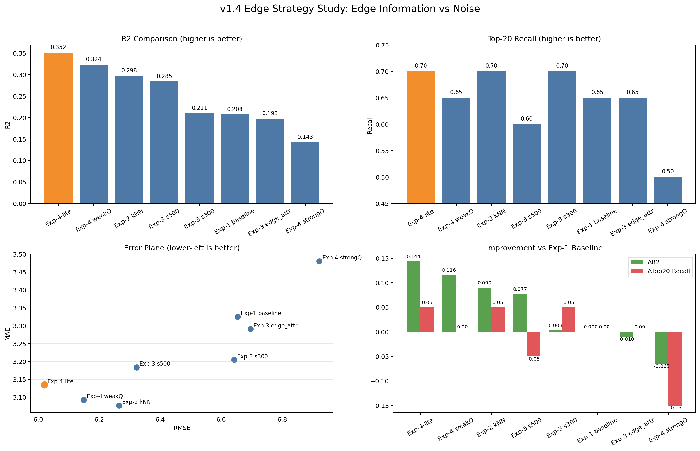
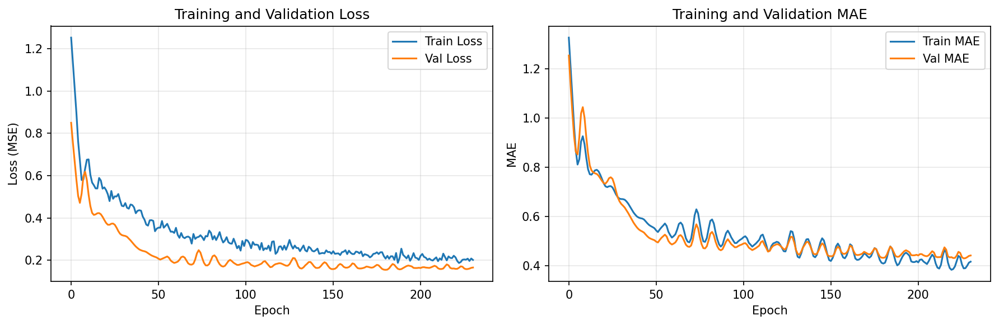
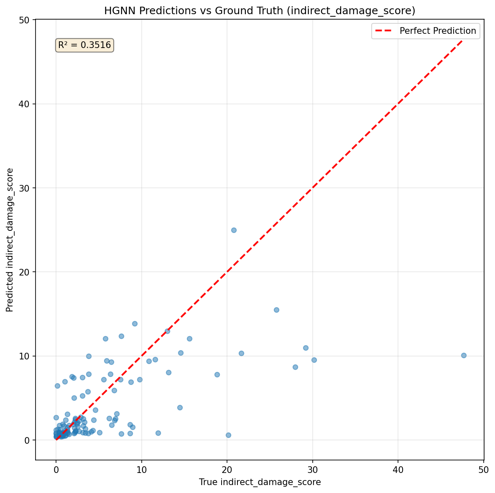
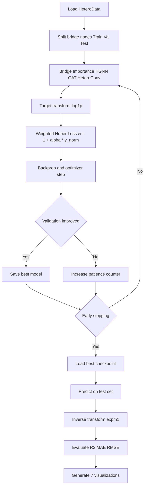
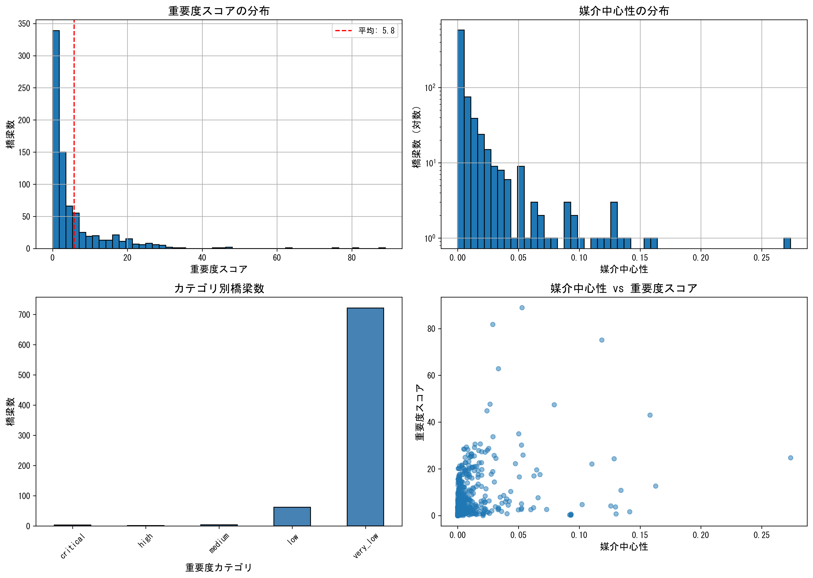
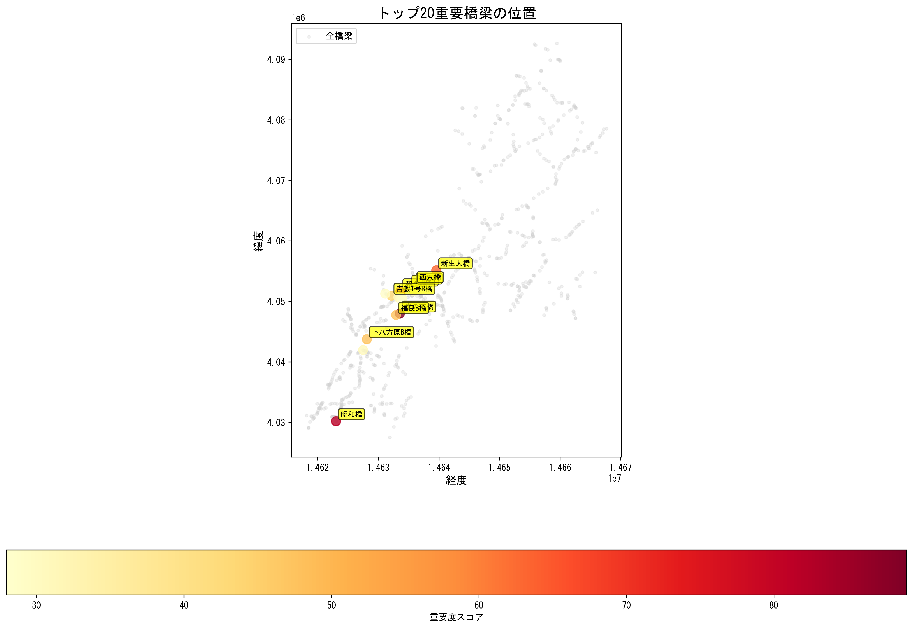

# Bridge Importance Scoring MVP : Infra2Graph prototyping

山口市791橋を対象とした橋梁重要度スコアリングシステム

[](VERSION)
[](LICENSE)
[](https://www.python.org/downloads/)
[](https://networkx.org/)
[](CHANGELOG.md)

## 概要

本プロジェクトは、**Infra2Graph**と**NetworkX媒介中心性（Betweenness Centrality）**を活用し、都市インフラである橋梁の重要度を定量的に評価するMVP（Minimum Viable Product）です。

### 目的

- 橋梁の「どれだけ多くの交通経路がその橋梁を通過するか」を媒介中心性で定量化
- 「失われれば甚大な影響が出るボトルネック橋梁」を特定
- 物理的健全性、社会インフラ、外部環境を統合した異種グラフによる評価

### 特徴

1. **異種グラフ（Heterogeneous Graph）の構築**

   - 橋梁、道路ネットワーク、建物、バス停を統合
   - OSMデータの自動取得
   - 河川・海岸線データとの統合
2. **媒介中心性に基づくスコアリング**

   - NetworkXによる厳密な中心性計算
   - 公共施設アクセス、交通量を考慮した重み付きスコア
   - 0-100の直感的なスコア表示
3. **説明可能性（Explainability）**

   - 各橋梁に対する人間可読な説明文の自動生成
   - リスク要因（河川、塩害）の可視化
   - マークダウン形式の詳細レポート

### v1.1の新機能：HGNN統合

4. **異種グラフニューラルネットワーク（HGNN）**
   - PyTorch Geometricによる深層学習統合
   - HeteroConv + GATConv/SAGEConvモデル
   - GNNによる橋梁重要度スコア予測
   - 複数ノードタイプの特徴学習（橋梁、道路、建物）

**新機能の詳細:**

- **ノード特徴量エンジニアリング**: 健全度区分、橋齢、環境リスク、構造属性
- **グラフベース学習**: 従来の中心性指標を超えた複雑な空間関係の学習
- **予測モデリング**: Train/test分割によるMAE、MSE、R²評価
- **スケーラビリティ**: 異種グラフデータでの効率的なトレーニング

### v1.3完了アップデート（2026-03-29）

v1.3では、橋梁閉鎖時の間接被害（`indirect_damage_score`）予測パイプラインを完成しました。

- 777橋（LCC）に対する閉鎖シナリオ指標を算出
- HGNNターゲットを `indirect_damage_score` に変更
- 異種グラフに逆方向エッジ `bridge->street` を追加
- 学習改善として `log1p` 変換、Huber損失、重み付き損失を導入
- 7つの可視化図による学習・誤差・ランキング分析を追加

**性能改善（テスト）:**

- ベースライン: `R²=-0.056`, `MAE=4.77`, `RMSE=7.68`
- v1.3改善版: `R²=0.179`, `MAE=3.38`, `RMSE=6.77`
- v1.3重み付き: `R²=0.288`, `MAE=3.20`, `RMSE=6.31`

### v1.4完了アップデート（2026-03-29）

v1.4実験シリーズを、**Infra2Graphパイプラインの原型（prototype）**として確定しました。

- 採用方針: **Exp-4-lite** を v1.4 の参照構成として採用
- 位置づけ: エッジ情報ノイズを含む地理空間データに対して、橋梁-道路のグラフ学習設計を定義する初期版
- 根拠データ: `output/v1_4_experiment_comparison/v1_4_experiment_comparison.csv`

**比較結果の1枚図（エッジ情報とノイズ）:**



要約ドキュメント:
- `Lesson_edge_info_noise.md`

**Infra2Graph原型のエッジアルゴリズム（v1.4）:**

- 橋梁-道路エッジは、従来のスナップ接続中心ではなく `kNN (k=3)` を採用
- 距離由来のエッジ属性（edge attributes）は、スケーリング次第でノイズ化するため「任意機能」として扱う
- 学習は弱い分位点重み付け（quantile-based weighting）を利用し、高影響橋梁への感度を維持しつつ再現性を確保

**v1.4参照構成（Exp-4-lite）の性能:**

- `R²=0.3516`, `MAE=3.1347`, `RMSE=6.0203`, `Top-20 Recall=0.70`
- Exp-1ベースラインを上回り、全体適合と高リスク橋梁抽出のバランスが最も良好

**Exp-4-lite 学習エビデンス:**





**2図からの考察:**
- 学習/検証曲線は早期終了下でも安定に収束しており、過学習リスクが抑制されている。
- 予測散布図は先行するv1.4バリアントより対角線への整合が改善し、採用構成の妥当性を裏付ける。
- 極端な高影響サンプルでは過小予測が一部残るが、上位抽出性能（`Top-20 Recall=0.70`）は十分維持されている。

**Infra2Graph設計への教訓:**

- エッジの位相設計（kNN化）は一貫して有効
- エッジ属性情報は多ければ良いわけではなく、過剰情報はRecallを悪化させる場合がある
- 原型段階では「位相優先 + 保守的な重み付け」が最も頑健

## プロジェクト構造

```
bridge_importance_score/
├── config.yaml                     # 設定ファイル
├── main.py                         # メインパイプライン
├── data_loader.py                  # データ読み込みモジュール
├── graph_builder.py                # 異種グラフ構築モジュール
├── centrality_scorer.py            # 媒介中心性計算・スコアリング
├── narrative_generator.py          # 説明文生成モジュール
├── bridge_closure_simulator.py     # [v1.2] 橋梁閉鎖影響シミュレーター
├── run_closure_simulation.py       # [v1.2] シミュレーション実行スクリプト
├── osm_grid_fetcher.py             # [v1.2] グリッドベースOSMデータ取得
├── fetch_osm_grid.py               # [v1.2] OSMグリッド取得実行スクリプト
├── recompute_centrality.py         # [v1.3] 777橋の閉鎖指標再計算
├── convert_to_heterodata.py        # [v1.3] HeteroData変換実行
├── train_hgnn.py                   # [v1.3] HGNN学習
├── visualize_hgnn_results.py       # [v1.3] HGNN結果可視化（7図）
├── requirements.txt                # 依存パッケージ
├── VERSION                         # プロジェクトバージョン
├── RELEASE_NOTES_v1.2.0.md         # v1.2リリースノート
├── releas_notes_v1.3.0.md          # v1.3リリースノート
├── OSM_GRID_FETCH_GUIDE.md         # OSMグリッド取得ガイド
├── data/                           # データディレクトリ
│   ├── Bridge_xy_location/         # 橋梁リスト（Excel）
│   ├── RiverDataKokudo/            # 河川データ（国土数値情報）
│   └── KaigansenDataKokudo/        # 海岸線データ（国土数値情報）
└── output/                         # 出力ディレクトリ
    └── bridge_importance/          # 結果ファイル
        └── closure_simulation/     # [v1.2] 閉鎖シミュレーション結果
```

## セットアップ

### 1. 環境構築

```bash
# Pythonバージョン: 3.8以上推奨
python -m venv venv
source venv/bin/activate  # Windows: venv\Scripts\activate

# 依存パッケージのインストール
pip install -r requirements.txt
```

### 2. データ準備

以下のデータを配置：

- **橋梁リスト**: `data/Bridge_xy_location/YamaguchiPrefBridgeListOpen251122_154891.xlsx`
  - カラム: 橋梁ID、名称、経度、緯度、健全度など
- **河川データ**: `data/RiverDataKokudo/W05-08_35_GML/`
  - 国土数値情報 河川データ（シェープファイル）
- **海岸線データ**: `data/KaigansenDataKokudo/C23-06_35_GML/`
  - 国土数値情報 海岸線データ（シェープファイル）

### 3. 設定ファイルの編集

`config.yaml`で以下を調整：

- データパス
- OSM取得範囲（山口市の境界）
- 近接関係の閾値（bridge_to_building: 1000mなど）
- スコアリングの重みづけ

## OSMデータ取得方法

### 小規模エリア（< 100 km²）: 通常モード

小規模なエリア（単一の町や小さな市）では、OSMから直接データを取得できます：

```bash
python main.py
```

このモードでは、`graph_builder.py`が自動的にOSMnx経由でデータを取得します。

### 大規模エリア（> 500 km²）: グリッド分割モード ⚡

**山口市（~1,000 km²）などの大規模エリアでは、OSMnx APIのレート制限により単一リクエストが失敗します。**

この問題を解決するため、**4×4グリッド分割取得システム**を使用してください：

#### ステップ1: グリッド分割でOSMデータを取得

```bash
# 山口市を4×4グリッドに分割し、セル単位でOSMデータを取得
python fetch_osm_grid.py
```

**処理内容:**

1. 山口市の境界ポリゴンを取得（Nominatim API）
2. 4×4（16セル）のグリッドに分割
3. 各セルごとに以下を取得（5秒待機でレート制限回避）：
   - 道路ネットワーク（nodes + edges）
   - 建物（オプション）
   - バス停（オプション）
4. 全セルの道路ネットワークをマージ
   - ノードIDの一意化
   - 重複ノード削除（1m精度で統合）
   - 密な結合グラフを生成

**推定所要時間:** 15-30分（リトライ込み）

**出力ファイル:**

- `output/bridge_importance/osm_cells/cell_XX_roads_nodes.gpkg` - 各セルの道路ノード
- `output/bridge_importance/osm_cells/cell_XX_roads_edges.gpkg` - 各セルの道路エッジ
- `output/bridge_importance/yamaguchi_merged_roads_nodes.gpkg` - マージされたノード（全市域）
- `output/bridge_importance/yamaguchi_merged_roads_edges.gpkg` - マージされたエッジ（全市域）
- `output/bridge_importance/grid_visualization.png` - グリッド可視化図

#### ステップ2: マージされたネットワークでパイプラインを実行

```bash
# グリッド取得モードでメインパイプラインを実行
python main.py --use-merged-network
```

このモードでは、OSMへの新規リクエストを行わず、事前取得済みのマージネットワークを使用します。

#### グリッド取得のカスタマイズ

`fetch_osm_grid.py`の設定を変更して、グリッド分割数や取得データを調整できます：

```python
# グリッドサイズの変更（デフォルト: 4×4）
grid_gdf = fetcher.make_grid_over_polygon(city_poly, n_rows=3, n_cols=3)  # 3×3グリッド

# 取得データの選択
stats = fetcher.run_for_all_cells(
    grid_gdf,
    fetch_roads=True,        # 道路ネットワーク（必須）
    fetch_buildings=True,    # 建物（オプション、時間増加）
    fetch_bus_stops=True,    # バス停（オプション、時間増加）
    inter_cell_delay=10      # セル間待機時間（秒、デフォルト: 5）
)
```

**レート制限対策のベストプラクティス:**

- セル間待機時間: 5-10秒（`inter_cell_delay`）
- リトライ設定: 各セル3回まで自動リトライ
- タイムアウト: 180秒/リクエスト
- キャッシュ有効化: `ox.settings.use_cache = True`

## 実行方法

### 通常モード（小規模エリア）

```bash
# メインパイプラインの実行
python main.py
```

### グリッドモード（大規模エリア）

```bash
# 1. グリッド分割でOSMデータ取得
python fetch_osm_grid.py

# 2. マージされたネットワークで実行
python main.py --use-merged-network
```

### 主な処理ステップ

1. **データ読み込み**: 橋梁リスト、河川、海岸線データの読み込み
2. **異種グラフ構築**: OSMから道路・建物・バス停を取得し統合グラフを生成
3. **媒介中心性計算**: NetworkXで橋梁ノードの中心性を計算
4. **スコアリング**: 中心性と社会的影響を統合した0-100スコアを算出
5. **説明文生成**: 各橋梁の重要度を日本語で説明
6. **結果保存**: CSV、GeoJSON、レポート（Markdown）を出力

## v1.2 新機能: 橋梁閉鎖影響シミュレーション 🆕

**v1.2で追加された新機能**: 個別橋梁の閉鎖が道路ネットワークに与える具体的な影響を定量化します。

### 機能概要

橋梁が通行止めになったシナリオで、以下の3つの影響指標を測定します：

1. **平均最短経路長の変化** (`delta_avg_shortest_path_pct`)

   - ネットワーク全体の経路効率への影響
   - 例：5.2% → 橋梁閉鎖により平均移動距離が5.2%増加
2. **接続可能ノード数の減少** (`delta_connected_nodes_pct`)

   - 到達不能になる道路ノードの割合
   - 例：2.8% → 全道路の2.8%が孤立化
3. **アクセス可能バス停数の減少** (`delta_accessible_bus_stops_pct`)

   - 公共交通への影響
   - 例：4.1% → バス停の4.1%が到達不能に

### 実行方法

```bash
# 前提: main.py を実行済みであること（グラフ生成）
python run_closure_simulation.py
```

**オプション:**

```bash
# サンプリングサイズの変更（デフォルト: 500ノード）
python run_closure_simulation.py --sample-size 1000

# 重要度「Very Low」の橋梁も含める（デフォルト: Low以上のみ）
python run_closure_simulation.py --include-very-low

# カスタム設定ファイルの使用
python run_closure_simulation.py --config my_config.yaml
```

### 処理時間

- **132橋梁** (Low以上): 約4-5分
- **791橋梁** (全橋梁): 約25-30分
- **処理速度**: 約2秒/橋梁

### 出力ファイル（v1.2）

シミュレーション結果は `output/bridge_importance/closure_simulation/` に保存されます：

1. **closure_simulation_results.csv** - 全橋梁の影響データ（11列）

   - 橋梁ID、名称、重要度カテゴリー
   - ベースライン指標（閉鎖前）
   - 閉鎖時指標（閉鎖後）
   - デルタ指標（変化率 %）
2. **closure_impact_report.md** - Markdownレポート

   - シミュレーション概要
   - Top 10 ランキング（3つの影響指標別）
   - 統計サマリー
   - 全橋梁の詳細結果テーブル
3. **closure_impact_distribution.png** - 影響分布の可視化（4プロット）

   - 平均経路長変化率の分布
   - 接続ノード減少率の分布
   - バス停減少率の分布
   - 総合影響スコアの分布
4. **closure_impact_top10.png** - Top 10 ランキング可視化（3つのバーチャート）

   - 経路長影響Top 10
   - ノード孤立化Top 10
   - バス停影響Top 10

### CSV出力カラム

```csv
bridge_id, bridge_name, importance_category,
baseline_avg_shortest_path, baseline_connected_nodes, baseline_accessible_bus_stops,
closure_avg_shortest_path, closure_connected_nodes, closure_accessible_bus_stops,
delta_avg_shortest_path_pct, delta_connected_nodes_pct, delta_accessible_bus_stops_pct
```

### 活用シーン

- **災害対応計画**: 地震・洪水時の橋梁閉鎖シナリオ分析
- **維持管理優先度付け**: 閉鎖影響の大きい橋梁への優先投資
- **迂回路計画**: 通行止め時の代替経路の事前検討
- **予算折衝**: 定量的根拠に基づく予算要求（「この橋を閉鎖すると移動距離が8%増加」）

### 技術仕様

- **アルゴリズム**: サンプリングベース最短経路計算（O(n·s·log n)）
- **サンプリング**: デフォルト500ノード（調整可能）
- **グラフ操作**: NetworkX copy-and-remove
- **進捗表示**: tqdmプログレスバー
- **依存**: NetworkX, GeoPandas, Matplotlib, Seaborn

詳細は [RELEASE_NOTES_v1.2.0.md](RELEASE_NOTES_v1.2.0.md) を参照してください。

## v1.3 新機能: 閉鎖影響予測HGNN（重み付き学習） 🆕

v1.3では、橋梁閉鎖影響の代理指標 `indirect_damage_score` を予測する HGNN 回帰モデルを導入しました。

### 学習フロー（v1.3）



### 損失関数の工夫

1. `log1p`ターゲット変換

   - ロングテール分布の歪みを緩和し、学習安定性を改善。
2. Huber損失

   - 外れ値に対して MSE より頑健。
3. 重み付き損失（高スコア橋重視）

   - `weight = 1 + alpha * y_norm`（`alpha=3.0`）
   - 高影響橋の学習寄与を増やし、重要橋の見逃しを低減。

### 実行手順（v1.3）

```bash
# 1) 777橋の閉鎖シナリオ指標を算出
python recompute_centrality.py

# 2) HeteroDataに変換
python convert_to_heterodata.py

# 3) HGNN学習（重み付き設定はconfig.yamlで有効化）
python train_hgnn.py

# 4) 7図の可視化
python visualize_hgnn_results.py --result-dir output/hgnn_training_v1_3_weighted --baseline-metrics output/hgnn_training_v1_3/test_metrics.csv
```

### 出力ファイル（v1.3）

`output/hgnn_training_v1_3_weighted/` に保存されます：

- `best_hgnn_model.pt` - 学習済み最良モデル
- `training_history.csv` - 学習履歴
- `test_metrics.csv` - 評価指標（MSE, MAE, RMSE, R²）
- `predictions_vs_truth.png` - 予測散布図
- `visualization/fig1_training_curves.png` - 学習曲線
- `visualization/fig2_pred_vs_true.png` - 予測 vs 真値
- `visualization/fig3_error_distribution.png` - 誤差分布
- `visualization/fig4_target_distribution.png` - ターゲット分布比較
- `visualization/fig5_top_bridges_ranking.png` - 上位橋梁ランキング
- `visualization/fig6_residuals.png` - 残差分析
- `visualization/fig7_metrics_summary.png` - メトリクスサマリー

## 出力ファイル

実行後、`output/bridge_importance/`に以下が生成されます：

- `bridge_importance_scores.csv` - 全橋梁のスコア一覧（CSV）
- `bridge_importance_scores.geojson` - 地図化用GeoJSON
- `bridge_importance_report.md` - 詳細レポート（Markdown）
- `top10_critical_bridges.csv` - トップ10橋梁の詳細
- `heterogeneous_graph.pkl` - グラフオブジェクト（Pickle）
- `score_distribution.png` - スコア分布の可視化
- `top20_bridges_map.png` - トップ20橋梁の地図
- `interactive_bridge_map.html` - 対話的Web地図
- `v1_4_score_distribution.png` - v1.4スコア分布の可視化
- `v1_4_top20_bridges_map.png` - v1.4トップ20橋梁の地図
- `v1_4_interactive_bridge_map.html` - v1.4対話的Web地図
- `metadata.yaml` - 実行メタデータ

## 可視化結果

システムは包括的な可視化を生成し、v1.4の閉鎖影響スコア（`indirect_damage_score`）とその空間分布を探索できます。

### v1.4 スコア分布分析



v1.4のスコア分布可視化は4つの重要な洞察を提供します：

1. **重要度スコア分布（左上）**:

   - 強い右裾の分布（低影響橋が多く、高影響橋は少数）
   - 大部分の橋梁は小さい`indirect_damage_score`に集中
   - ロングテールは少数の高影響閉鎖候補の存在を示す
2. **媒介中心性分布（右上）**:

   - 対数スケールでべき乗則的分布を示す
   - 少数の橋梁が極めて高い中心性を持つ
   - 大半の橋梁は相対的に低い中心性（< 0.05）
3. **カテゴリ別分布（左下）**:

   - 地図上の可読性のため、正規化v1.4スコア（`importance_score_100`）でカテゴリ化
   - low/very-lowに分布が集中し、長尾分布の特徴と整合
   - 少数橋梁が不均衡に大きい閉鎖影響を持つことを示唆
4. **中心性とスコアの相関（右下）**:

   - 正の関係はあるが分散が大きい
   - 中心性単独では閉鎖影響を十分に説明できない
   - 単一指標よりHGNNベース予測が有効であることを支持

### v1.4 トップ20橋梁の地理的分布



**主要な観察結果：**

- **地理的集中**: 上位橋梁は都市の主要回廊沿いにクラスターを形成
- **戦略的立地**: 高影響橋梁は以下周辺に多い:

  - 高速道路インターチェンジへのアクセスポイント
  - 主要幹線道路の交差点
  - 河川横断地点
- **カラーグラデーション**: 黄色 -> 赤はv1.4影響スコアの増加を示す
- **空間パターン**: 重要橋梁は孤立点ではなくネットワークのバックボーンを形成し、体系的ボトルネック構造を示唆

### v1.4 対話的Web地図

システムはFoliumを使用した完全な対話的HTMLマップを生成します（`v1_4_interactive_bridge_map.html`）。

**機能：**

- 🗺️ **パン＆ズーム**: 山口市全域791橋を探索
- 🎨 **色分けマーカー**: 緑（低）→ 黄 → オレンジ → 赤（高重要度）
- 📏 **サイズ調整アイコン**: マーカーサイズはv1.4影響スコアに比例
- 📋 **詳細ツールチップ**: 任意の橋梁をクリックして表示:
  - 橋梁名、ランク、重要度スコア
  - 媒介中心性値
  - 周辺施設（病院、学校、バス停）
  - 河川・海岸線までの距離
  - リスク評価説明文

v1.4の対話地図を開く手順:

```bash
# v1.4可視化ファイルを生成
python run_visualization.py --mode v1_4 --top-n 20

# ブラウザで開く（Windows PowerShell）
start "" "output/bridge_importance/v1_4_interactive_bridge_map.html"
```

### 可視化の再生成

既存結果から可視化を再生成するには（legacy / v1.4）：

```bash
# legacy importance_score 可視化
python run_visualization.py

# v1.4 closure-impact 可視化
python run_visualization.py --mode v1_4 --top-n 20
```

以下が生成されます：

- `score_distribution.png` - legacy統計分布チャート
- `top20_bridges_map.png` - legacyトップ橋梁地理マップ
- `interactive_bridge_map.html` - legacy対話的Webマップ
- `v1_4_score_distribution.png` - v1.4統計分布チャート
- `v1_4_top20_bridges_map.png` - v1.4トップ橋梁地理マップ
- `v1_4_interactive_bridge_map.html` - v1.4対話的Webマップ（ブラウザで開く）

## 出力例

### スコア付き橋梁（CSVカラム）

| bridge_id | importance_rank | importance_score | importance_category | betweenness | num_public_facilities | narrative                                                          |
| --------- | --------------- | ---------------- | ------------------- | ----------- | --------------------- | ------------------------------------------------------------------ |
| BR_0530   | 1               | 80.0             | high                | 0.3083      | 0                     | 【高重要度】高い重要度を持つ橋梁です（ランク1位、スコア80.0）。... |

### 説明文の例

> 【高重要度】高い重要度を持つ橋梁です（ランク1位、スコア80.0）。この橋梁は、多数の交通経路が通過する重要な結節点であり、通行不能になると広範囲に影響が及びます。

## 設計思想

### 異種グラフのレイヤー構成

1. **橋梁（bridge）**: 評価対象の791橋（山口市）
2. **道路ネットワーク（street）**: OSMから取得した交通ネットワーク
3. **建物（building）**: 住宅、病院、学校、公共施設
4. **バス停（bus_stop）**: 公共交通の結節点
5. **河川**: 洪水リスク評価用
6. **海岸線**: 塩害リスク評価用

### スコアリングの重みづけ（デフォルト）

- **媒介中心性**: 60% - 交通ネットワーク上のボトルネック度
- **公共施設アクセス**: 20% - 病院・学校などへの接続性
- **交通量代理**: 20% - 道路接続数・バス停数

## 拡張性

本MVPは以下の拡張が可能です：

### Phase 2: HGNN（Heterogeneous Graph Neural Network）

- PyTorch GeometricのHeteroDataへ変換済み
- 物理的健全性スコア（橋梁の劣化度）をノード特徴に追加
- 将来の損傷リスク予測モデルの構築

### Phase 3: 時系列・動的分析

- 交通量データのリアルタイム統合
- 災害シミュレーション（橋梁閉鎖時の影響予測）
- 維持管理予算の最適配分

## 技術スタック

- **Python**: 3.8+
- **NetworkX**: グラフ分析・中心性計算
- **GeoPandas**: 地理空間データ処理
- **OSMnx**: OpenStreetMapデータ取得
- **PyYAML**: 設定管理

## トラブルシューティング

### OSMデータ取得エラー

OSMnxのタイムアウトが発生する場合：

```python
import osmnx as ox
ox.settings.timeout = 300  # タイムアウトを5分に延長
```

### メモリ不足

大規模グラフで媒介中心性の計算が重い場合、`config.yaml`で近似計算を有効化：

```yaml
centrality:
  k: 100  # サンプルノード数（Noneで全ノード）
```

### 座標系の問題

橋梁データの座標系が不明な場合、`data_loader.py`で適切なEPSGコードを指定してください。

## 参考文献・データソース

- **OpenStreetMap**: 道路・建物・POIデータ
- **国土数値情報**: 河川・海岸線データ（国土交通省）
- **山口県オープンデータ**: 橋梁リスト

## ライセンス

本プロジェクトは研究・教育目的で作成されています。データの再利用は各データソースのライセンスに従ってください。

## 開発者

Bridge Importance Scoring MVP Project Team

---

**最終更新**: 2024年3月28日

## English Version

For English documentation, see [README.md](README.md)
