# Bridge Importance Scoring MVP - Release Notes v1.1.0

**リリース日**: 2026年3月29日  
**バージョン**: 1.1.0  
**リリースタイプ**: 機能追加（HGNN統合）

---

## 🎉 新機能：異種グラフニューラルネットワーク（HGNN）統合

v1.1 では、**PyTorch Geometric**を統合し、**深層学習による橋梁重要度予測**機能を追加しました。従来の NetworkX 媒介中心性に加えて、グラフニューラルネットワーク（GNN）による予測モデルを構築できます。

### 主な追加機能

#### 1. HeteroData 変換モジュール (`hetero_data_converter.py`)

- NetworkX 異種グラフを PyTorch Geometric の `HeteroData` 形式に変換
- ノードタイプごとの特徴量抽出
  - **Bridge ノード (25特徴)**:
    - 健全度区分（Ⅰ-Ⅳ、one-hot encoded）
    - 橋齢、橋長、幅員
    - 河川・海岸線からの距離（対数スケール）
    - 既存の媒介中心性スコア
    - 周辺施設数（建物、病院、学校、公共施設）
    - Binary flags: 離島架橋、長大橋、特殊橋、重要物流道路、緊急輸送道路、跨線橋、跨道橋
  - **Street ノード**: 正規化座標 (x, y)
  - **Building ノード**: 建物カテゴリ（one-hot encoded）
  - **Bus Stop ノード**: プレースホルダー（将来拡張用）

- エッジタイプの自動抽出
  - `(bridge, to, street)`, `(bridge, to, building)`, `(street, to, street)` など

#### 2. HGNN モデル定義 (`hgnn_model.py`)

- **BridgeImportanceHGNN**: 標準モデル（2層 HeteroConv）
  - HeteroConv + GATConv（Graph Attention Networks）
  - HeteroConv + GraphSAGE
  - マルチヘッドアテンション（デフォルト: 4 heads）
  - ドロップアウト（0.2）
  - ノードタイプごとのエンコーディング層

- **BridgeImportanceHGNN_Simple**: 簡易モデル（1層 HeteroConv）
  - 小規模データや高速プロトタイピング用

- **タスク**: ノード回帰（Bridge ノードの重要度スコア予測）

#### 3. トレーニングパイプライン (`train_hgnn.py`)

- **データ分割**:
  - Train: 70%
  - Validation: 15%
  - Test: 15%

- **トレーニング機能**:
  - MSE 損失関数
  - Adam オプティマイザ
  - Early stopping（patience=20）
  - 学習率: 0.001、Weight decay: 5e-4

- **評価指標**:
  - MSE（Mean Squared Error）
  - MAE（Mean Absolute Error）
  - RMSE（Root Mean Squared Error）
  - R²（決定係数）

- **可視化**:
  - トレーニング履歴（Loss/MAE曲線）
  - 予測値 vs 真値の散布図
  - 結果の CSV エクスポート

#### 4. データ変換スクリプト (`convert_to_heterodata.py`)

- 既存の NetworkX グラフ（`heterogeneous_graph.pkl`）と GeoDataFrame（`bridge_importance_scores.geojson`）から HeteroData を生成
- ノードタイプの自動検出と分類
- HeteroData の保存（`.pt` 形式）

---

## 📋 使い方

### ステップ 0: 既存パイプラインの実行（v1.0 機能）

```bash
# まず、v1.0 のパイプラインを実行して NetworkX グラフと重要度スコアを生成
python main.py
```

**出力**:
- `output/bridge_importance/heterogeneous_graph.pkl` - NetworkX グラフ
- `output/bridge_importance/bridge_importance_scores.geojson` - 重要度スコア付き橋梁データ

### ステップ 1: HeteroData への変換

```bash
python convert_to_heterodata.py
```

**出力**:
- `output/bridge_importance/heterogeneous_graph_heterodata.pt` - PyTorch Geometric HeteroData

**実行時間**: 約10-30秒

### ステップ 2: HGNN モデルのトレーニング

```bash
python train_hgnn.py
```

**出力**:
- `output/hgnn_training/best_hgnn_model.pt` - 学習済みモデル
- `output/hgnn_training/training_history.png` - Loss/MAE 曲線
- `output/hgnn_training/predictions_vs_truth.png` - 予測散布図
- `output/hgnn_training/test_metrics.csv` - テストメトリクス
- `output/hgnn_training/training_history.csv` - 履歴CSV

**実行時間**: 約5-15分（GPU使用時は1-3分）

---

## ⚙️ 設定

`config.yaml` に新しい `hgnn:` セクションを追加しました：

```yaml
hgnn:
  # モデルタイプ
  model_type: "standard"  # "standard" or "simple"
  
  # ハイパーパラメータ
  hidden_channels: 64
  num_layers: 2
  conv_type: "GAT"  # "GAT" or "SAGE"
  dropout: 0.2
  heads: 4  # GAT attention heads
  
  # トレーニング設定
  num_epochs: 100
  learning_rate: 0.001
  weight_decay: 0.0005
  patience: 20
  
  # データ分割
  train_ratio: 0.7
  val_ratio: 0.15
  test_ratio: 0.15
  random_seed: 42
```

---

## 📦 依存関係の追加

`requirements.txt` を更新し、以下のパッケージを追加しました：

```
torch>=2.0.0
torch-geometric>=2.3.0
torch-scatter>=2.1.0
torch-sparse>=0.6.17
scikit-learn>=1.0.0
```

**インストール**:

```bash
pip install -r requirements.txt
```

**注意**: PyTorch Geometric のインストールは環境依存です。詳細は [公式ドキュメント](https://pytorch-geometric.readthedocs.io/) を参照してください。

---

## 🔬 技術詳細

### モデルアーキテクチャ

#### HGNN モデル全体像

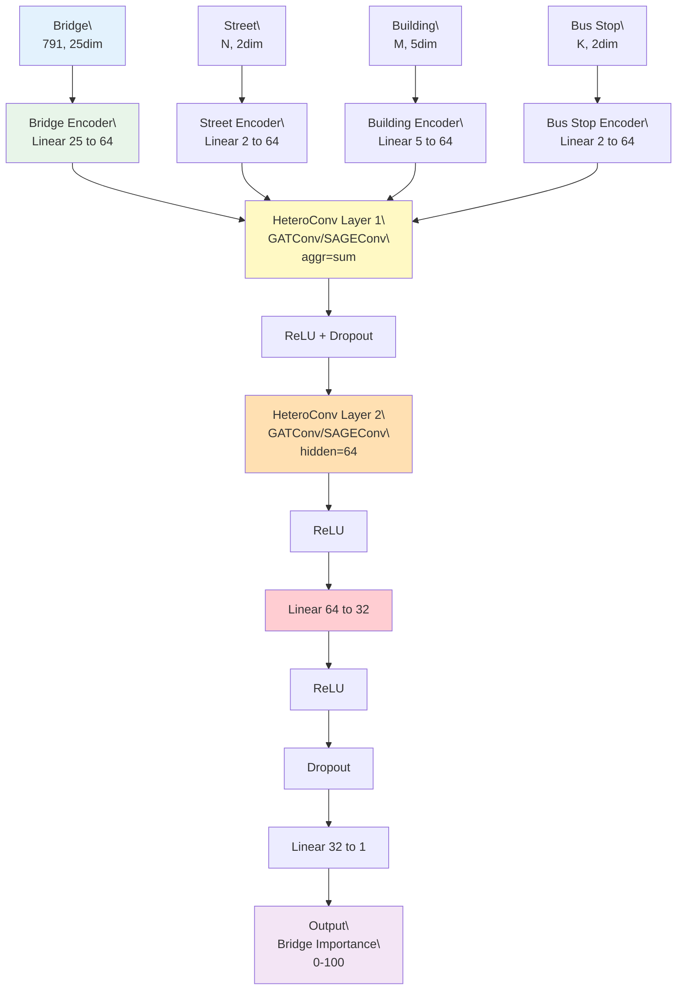

#### モデルの詳細解説

##### 1️⃣ 入力層：HeteroData

異種グラフの各ノードタイプは、独自の特徴量を持ちます：

| ノードタイプ | ノード数 | 特徴量次元 | 主な特徴量 |
|------------|---------|----------|-----------|
| **Bridge** | 791 | 25 | 健全度、橋齢、構造属性、環境リスク、媒介中心性 |
| **Street** | ~18,000 | 2 | 正規化座標 (x, y) |
| **Building** | ~1,000 | 5 | カテゴリ one-hot (residential/hospital/school/public/other) |
| **Bus Stop** | ~100 | 2 | プレースホルダー（将来拡張用） |

**エッジタイプ**:
- `(bridge, to, street)`: 橋梁と道路の接続
- `(bridge, to, building)`: 橋梁と建物の近接関係
- `(street, to, street)`: 道路ネットワーク
- など、合計5-8種類のエッジタイプ

##### 2️⃣ ノードエンコーダー

各ノードタイプの特徴量を、共通の埋め込み空間（64次元）に変換します。これにより、異なる特徴量次元を持つノードタイプ間でのメッセージパッシングが可能になります。

```python
# 例: Bridge ノードのエンコーディング
bridge_encoded = Linear(25 → 64)(bridge_features)  # [791, 25] → [791, 64]
```

##### 3️⃣ HeteroConv 層

**HeteroConv** は、異種グラフ上でのメッセージパッシングを実現する核心的なモジュールです。

**処理フロー**:
1. **エッジタイプごとの畳み込み**: 各エッジタイプに対して、GATConv または SAGEConv を適用
   - **GATConv**: マルチヘッドアテンション機構により、隣接ノードの重要度を動的に学習
     ```
     attention_score = softmax(LeakyReLU(a^T [Wh_i || Wh_j]))
     h_i' = Σ attention_score_ij * Wh_j
     ```
   - **SAGEConv**: 隣接ノードの特徴量を平均集約
     ```
     h_i' = σ(W · CONCAT(h_i, MEAN({h_j : j ∈ N(i)})))
     ```

2. **集約**: 各ノードタイプに対して、異なるエッジタイプから来たメッセージを集約（`aggr='sum'`）

3. **活性化**: ReLU 活性化関数とドロップアウト適用

**2層構造の意義**:
- **Layer 1**: 1-hop 近傍の情報を集約（直接接続されたノード）
- **Layer 2**: 2-hop 近傍の情報を集約（間接的につながったノード）

これにより、橋梁ノードは、直接接続された道路だけでなく、その先の建物や他の橋梁の情報も学習できます。

##### 4️⃣ 出力層

Bridge ノードの埋め込み（64次元）を、重要度スコア（1次元）に変換します。

```python
# 2層の全結合ネットワーク
x = ReLU(Linear(64 → 32)(bridge_embeddings))
x = Dropout(0.2)(x)
importance_score = Linear(32 → 1)(x)
```

**回帰タスク**: 出力は 0-100 の連続値（v1.0 の媒介中心性ベーススコアを学習）

---

#### GATConv の詳細（conv_type="GAT" の場合）

Graph Attention Networks (GAT) は、アテンション機構を用いて、隣接ノードの重要度を動的に学習します。

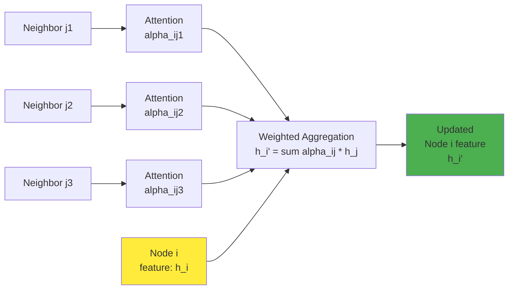

**マルチヘッドアテンション** (heads=4):
- 4つの独立したアテンション機構を並列実行
- 各ヘッドが異なる「注目パターン」を学習
- 最終的に4つの出力を連結または平均

**利点**:
- ノード間の重要度を動的に学習
- 異なるエッジタイプで異なるアテンションパターンを獲得
- 解釈可能性：アテンションスコアを可視化可能

---

### 学習プロセス

#### トレーニングフロー全体像

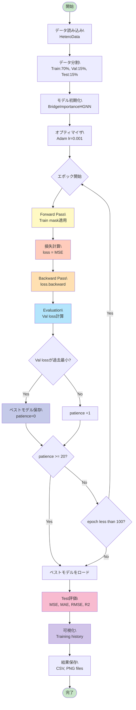

#### 詳細な学習ステップ

##### ステップ 1: Forward Pass（順伝播）

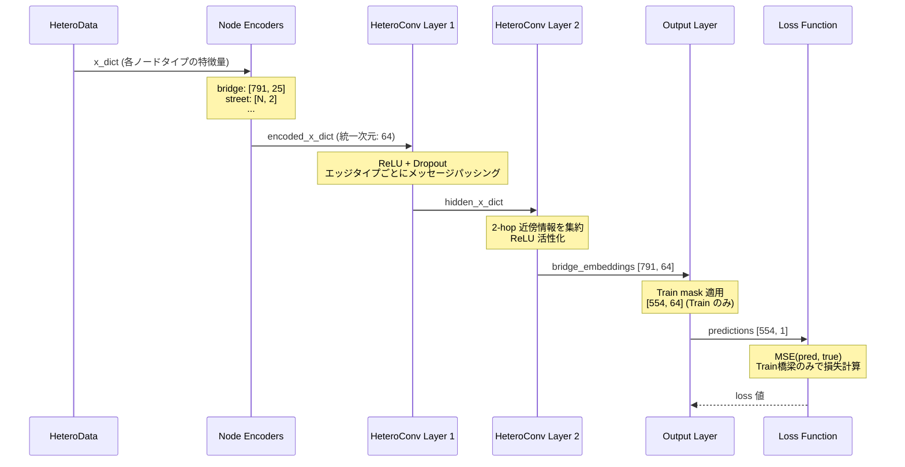

##### ステップ 2: Backward Pass（逆伝播）

勾配が出力層から入力層に向かって伝播し、各パラメータが更新されます：

1. **出力層の勾配計算**: `∂L/∂W_output`
2. **HeteroConv Layer 2 の勾配**: `∂L/∂W_conv2`（各エッジタイプごと）
3. **HeteroConv Layer 1 の勾配**: `∂L/∂W_conv1`
4. **ノードエンコーダーの勾配**: `∂L/∂W_encoder`（各ノードタイプごと）

**パラメータ更新**（Adam オプティマイザ）:
```
θ_t+1 = θ_t - α · m_t / (√v_t + ε)
```
- `θ`: パラメータ
- `α`: 学習率 (0.001)
- `m_t`: 1次モーメント（勾配の移動平均）
- `v_t`: 2次モーメント（勾配の二乗の移動平均）

##### ステップ 3: Early Stopping

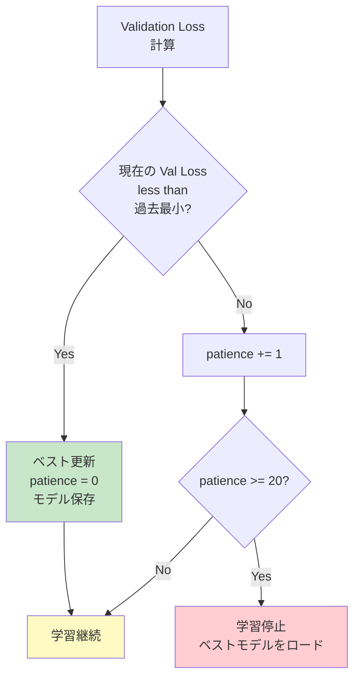

**過学習を防ぐ**: Validation loss が改善しなくなった時点で学習を停止し、最良のモデルを使用します。

##### ステップ 4: Test 評価

学習完了後、未見の Test データで最終評価を実施：

| 評価指標 | 説明 | 計算式 |
|---------|------|--------|
| **MSE** | 平均二乗誤差 | `Σ(y_pred - y_true)² / n` |
| **MAE** | 平均絶対誤差 | `Σ|y_pred - y_true| / n` |
| **RMSE** | 二乗平均平方根誤差 | `√MSE` |
| **R²** | 決定係数 | `1 - Σ(y_pred - y_true)² / Σ(y_true - ȳ)²` |

**R² の解釈**:
- R² = 1.0: 完璧な予測
- R² = 0.8: モデルが分散の80%を説明
- R² = 0.0: 平均値予測と同等
- R² < 0.0: 平均値より悪い予測

---

### 実装上の工夫

#### 1. Heterogeneous Graph の特徴

従来の同種グラフ（Homogeneous Graph）と異なり、異種グラフは以下の特徴を持ちます：

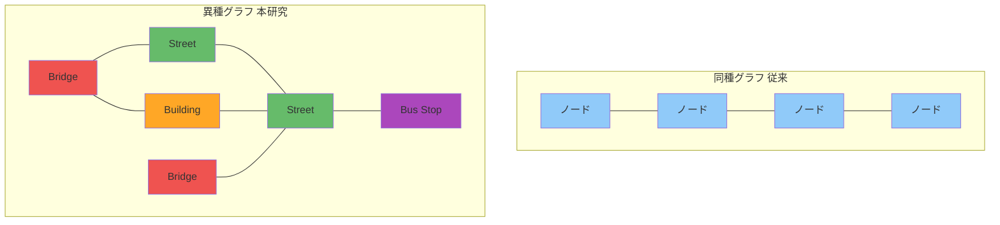

**異種グラフの利点**:
- 各ノードタイプが専用の特徴量を持てる
- エッジタイプごとに異なる関係性をモデル化
- より現実世界の複雑な構造を表現可能

#### 2. メッセージパッシングの可視化

例：ある橋梁ノード `BR_0530`（最高スコア橋梁）のメッセージパッシング

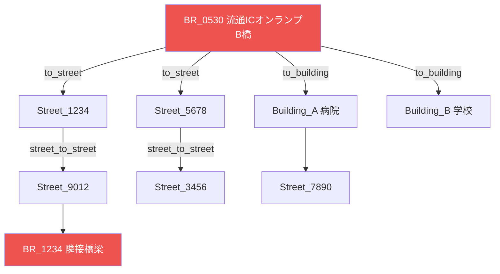

**情報の流れ**:
1. **Layer 1**: `BR_0530` は直接接続された道路・建物から情報を受け取る
2. **Layer 2**: さらにその先の道路網や他の橋梁の情報も間接的に学習
3. **最終埋め込み**: 局所的＋広域的な文脈を統合した表現を獲得

#### 3. Train/Val/Test 分割の重要性

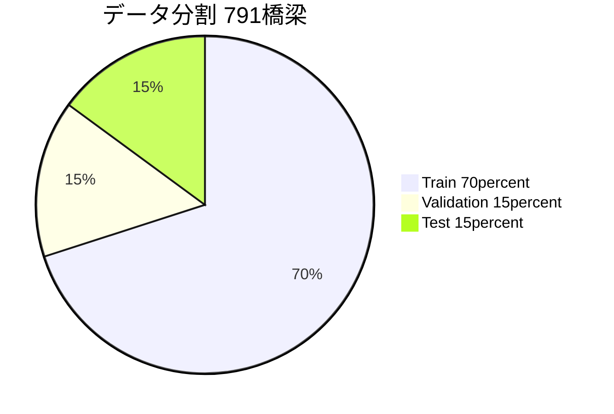

- **Train**: モデルのパラメータ学習に使用
- **Validation**: ハイパーパラメータ調整と Early stopping に使用
- **Test**: 最終評価のみ使用（学習中は一切使わない）

**リーク防止**: Test データは学習プロセスから完全に隔離され、真の汎化性能を評価


---

---

## 📊 期待される結果

v1.0 の NetworkX 媒介中心性ベースのスコアを ground truth として学習した場合、以下のような性能が期待されます：

### 評価指標の目標値

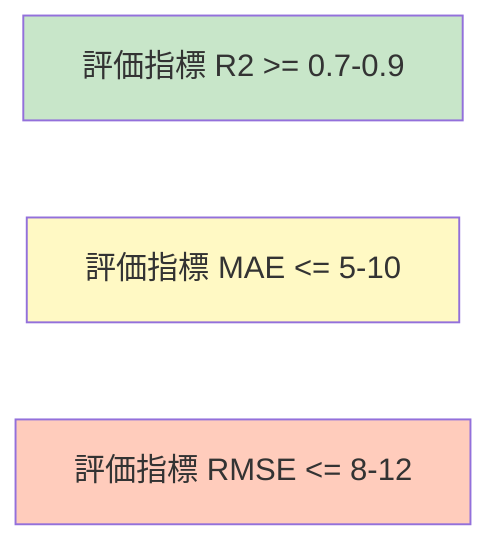

### 予測精度の解釈

#### R² スコアの意味

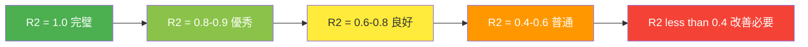

**R² = 0.8 の例**:
- 重要度スコアの分散の80%をモデルが説明
- 残り20%は、モデルが捉えていない要因（ノイズ、未観測変数など）

#### 予測誤差の分布（理想的なケース）

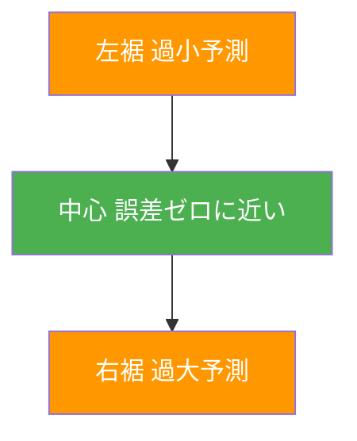

理想的には、予測誤差が正規分布に従い、大きな誤差が少ない状態を目指します。

### 実際の出力例

学習完了後、以下のような可視化が生成されます：

#### 1. Training History（学習履歴）

```
Epoch  Train Loss  Val Loss  Train MAE  Val MAE
  10      45.23      48.91      5.12      5.45
  20      28.67      32.14      3.89      4.21
  30      18.45      22.38      3.12      3.67
  40      12.89      18.76      2.45      3.22
  50      10.23      17.91      2.11      3.05  ← Best Val Loss
  60      9.87       18.45      2.03      3.18
  70      9.12       19.23      1.89      3.34  ← Early Stopping
```

**グラフの見方**:
- Train Loss が順調に減少 → 学習が進行
- Val Loss が途中から上昇 → 過学習の兆候
- Early Stopping が適切に動作 → 過学習前でストップ

#### 2. Predictions vs Truth（予測 vs 真値）

理想的な散布図のパターン：


### スコア範囲別の予測精度

HGNN は、スコア範囲によって予測精度が異なる可能性があります：

| スコア範囲 | 予測難易度 | 理由 |
|-----------|----------|------|
| **0-20 (Very Low)** | 🟢 易しい | データ数が多い（659橋、83%）|
| **20-40 (Low)** | 🟢 易しい | データ数が多い（85橋、11%）|
| **40-70 (Medium-High)** | 🟡 中程度 | データ数が中程度（41橋、5%）|
| **70-100 (Critical)** | 🔴 難しい | データ数が少ない（6橋、0.8%）、**不均衡データ問題**|

**対策**:
- クラス重み付け損失関数
- SMOTE（Synthetic Minority Over-sampling Technique）
- Focal Loss の適用

**注意**: これらは参考値であり、実際のデータや設定により異なります。学習結果は `output/hgnn_training/test_metrics.csv` で確認できます。

---

## 🚀 将来の拡張

v1.1 は HGNN の基盤を提供します。今後の拡張可能性：

### 開発ロードマップ

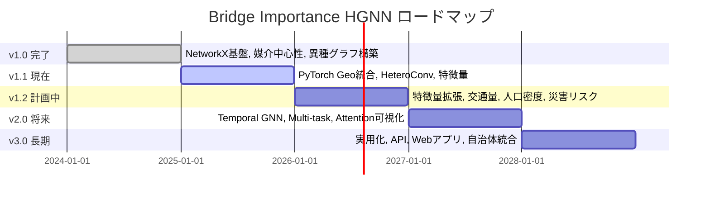

### 拡張の詳細

#### 1. 新しい特徴量の追加

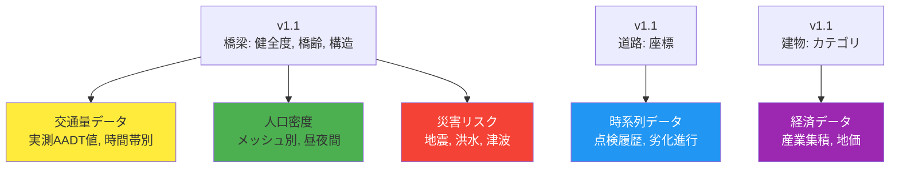

**期待される効果**:
- 予測精度の向上（R² > 0.9）
- より現実的な重要度評価
- 災害時の影響予測

#### 2. モデルの改良

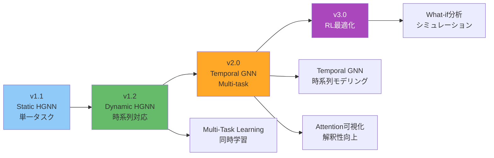

##### Multi-Task Learning の例

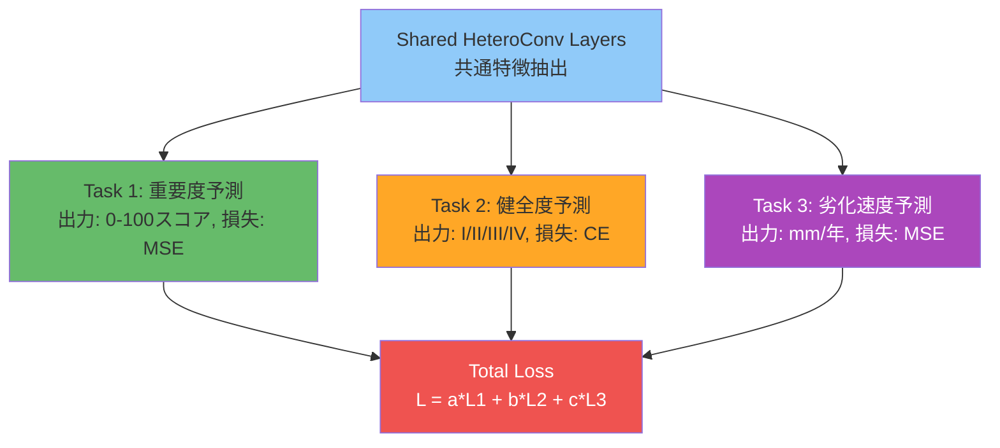

**利点**:
- 複数タスク間で知識を共有
- データ不足タスクの精度向上
- より一般化された特徴表現

#### 3. アプリケーション展開

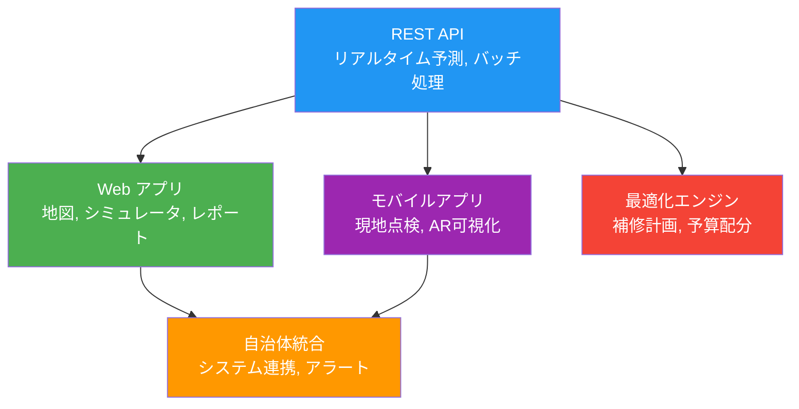

#### 実用化のユースケース

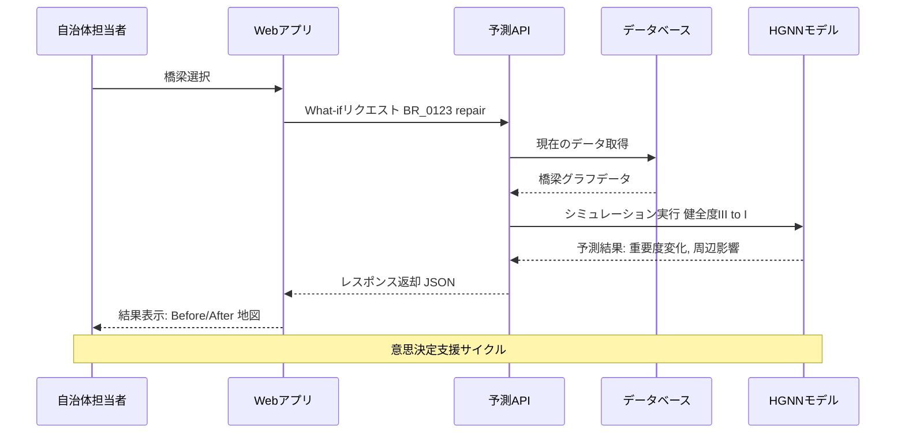

### 技術的課題と対策

| 課題 | 対策 |
|------|------|
| **スケーラビリティ** | GraphSAINT サンプリング、ミニバッチ学習 |
| **リアルタイム性** | モデル軽量化、キャッシング、推論最適化 |
| **データ不足** | Transfer Learning、Data Augmentation、合成データ |
| **解釈可能性** | Attention 可視化、SHAP 値、Layer-wise Relevance Propagation |
| **モデル更新** | Incremental Learning、Online Learning、A/B Testing |


---

## 🐛 既知の制限事項

- **データ依存性**: 学習は v1.0 の媒介中心性スコアを ground truth として使用するため、その精度に依存します
- **計算リソース**: GPU がない環境ではトレーニングに時間がかかる場合があります（CPU でも動作可能）
- **OSMnx API**: v1.0 から継承された OSM building/POI 取得の不安定性が残っています

---

## 📝 変更点まとめ

### 新規ファイル

- `hetero_data_converter.py`
- `hgnn_model.py`
- `train_hgnn.py`
- `convert_to_heterodata.py`
- `RELEASE_NOTES_v1.1.0.md`

### 更新ファイル

- `requirements.txt` - PyTorch Geometric 依存関係追加
- `config.yaml` - `hgnn:` セクション追加
- `VERSION` - 1.0.0 → 1.1.0
- `CHANGELOG.md` - v1.1.0 エントリ追加
- `README.md` - v1.1 使用方法追加
- `README_JP.md` - v1.1 機能説明追加
- `main.py` - バージョン 1.1.0 に更新
- `run_visualization.py` - バージョン 1.1.0 に更新

---

## 👥 貢献者

- v1.1 HGNN 統合: GitHub Copilot + User
- v1.0 基盤実装: Project Team

---

## 📞 サポート

質問や問題がある場合は、GitHub Issues を利用してください。

**Happy Bridge Importance Prediction! 🌉🤖**
