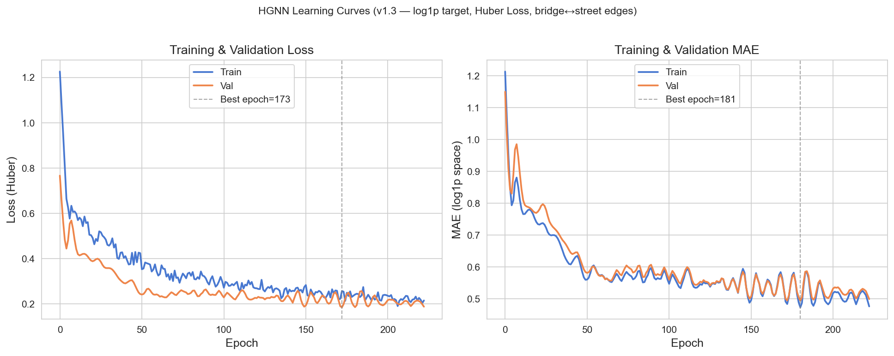
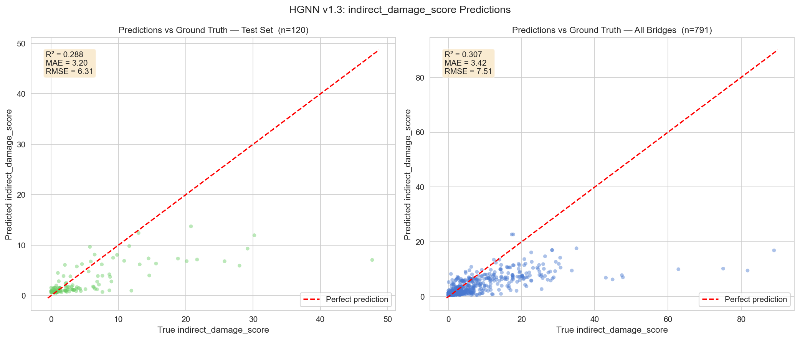
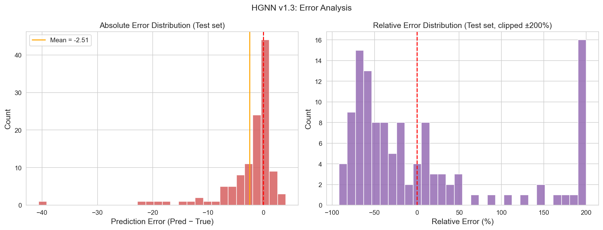
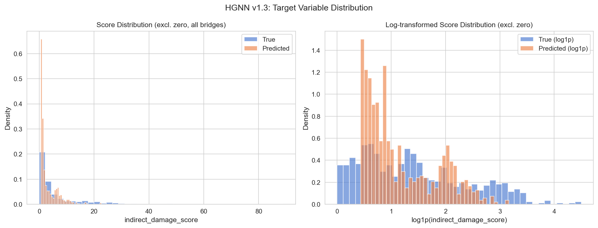
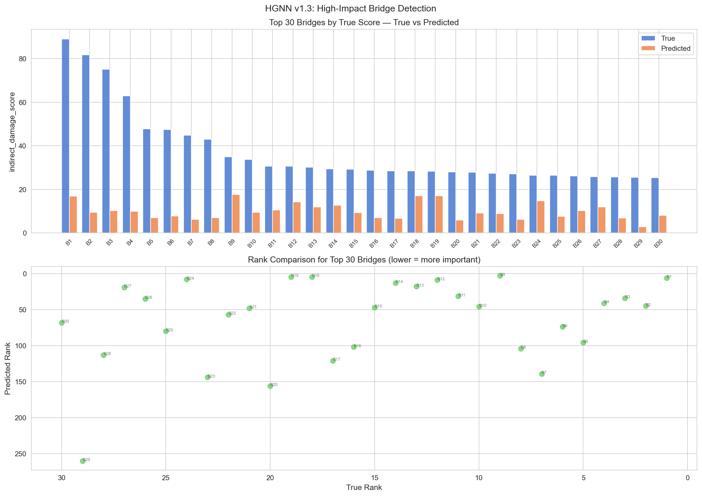
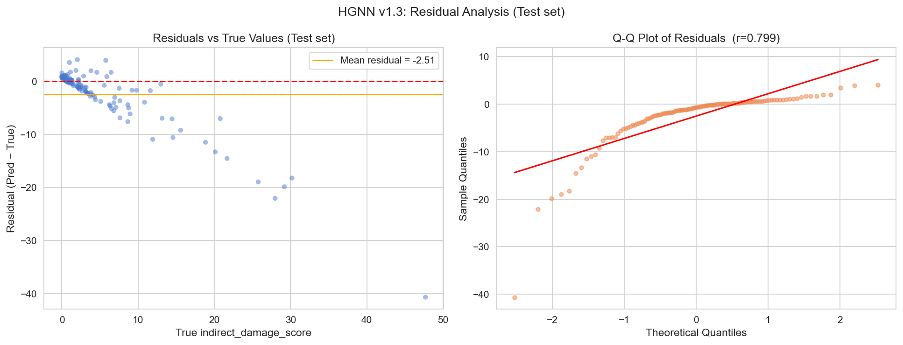
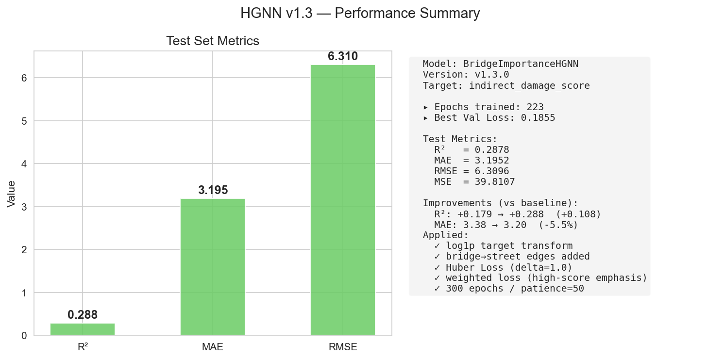

# Release Notes v1.3.0

## 概要

v1.3.0 では、橋梁閉鎖時の間接被害を予測する HGNN パイプラインを完成させた。
本リリースは、777橋の閉鎖シナリオ指標計算、HeteroData変換、HGNN学習、重み付き学習、可視化までを含む。

## 主要アップデート

- 閉鎖シナリオ指標を 777橋（LCC）に対して算出
- 予測ターゲットを `indirect_damage_score` に統一
- 異種グラフの逆方向エッジ `bridge->street` を追加
- 学習の安定化と高スコア橋重視のため以下を導入
- `log1p` ターゲット変換
- Huber 損失
- 重み付き損失（`weight = 1 + alpha * y_norm`, `alpha=3.0`）

## 性能サマリー

| モデル | R² | MAE | RMSE |
|---|---:|---:|---:|
| ベースライン | -0.056 | 4.77 | 7.68 |
| v1.3 改善版 | 0.179 | 3.38 | 6.77 |
| v1.3 重み付き | 0.288 | 3.20 | 6.31 |

## 可視化（7図）

### 1. 学習曲線

### 2. 予測値 vs 真値（テスト/全体）

### 3. 誤差分布

### 4. ターゲット分布比較

### 5. 上位橋梁ランキング比較

### 6. 残差分析

### 7. メトリクスサマリー

## 考察

- 全体性能はベースライン比で大きく改善した。特に R² は 0 を超え、説明力を持つモデルへ移行した。
- 重み付き損失により高スコア橋の学習寄与が増え、予測レンジが拡張した。
- 一方で高インパクト橋（真値20以上）の過小予測は残る。残差プロットでも負側の偏りが確認できる。
- 低スコア橋は十分に学習できているが、裾の重い分布に対する追従は未だ限定的である。

## 技術的な学び

- ターゲット歪みが大きい回帰問題では、`log1p` と Huber 損失の組み合わせが有効だった。
- 異種グラフでは逆方向エッジの有無が性能に直結した。
- 単純な MSE 最適化より、タスク優先度を反映した重み付き最適化が実運用に近い挙動を示した。

## 既知課題

- 建物・バス停の k-NN 特徴はグラフ上のノード欠如により有効活用できていない。
- 高スコア橋の予測上限が真値上限に届かず、極端ケースの捕捉力に課題がある。

## 次リリース候補

- OSM 由来の建物/バス停座標を別入力で統合し、k-NN特徴量を再有効化
- 高スコア橋に対する損失重みの自動調整（分位点ベース）
- 評価軸に Top-k 再現率（高影響橋検出）を追加
